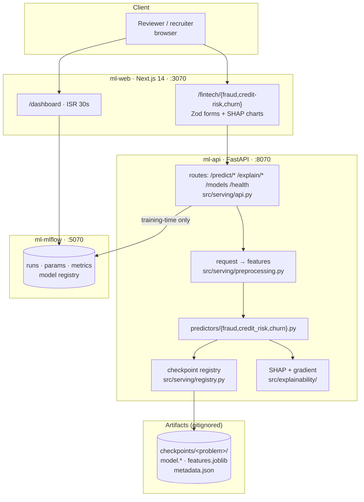
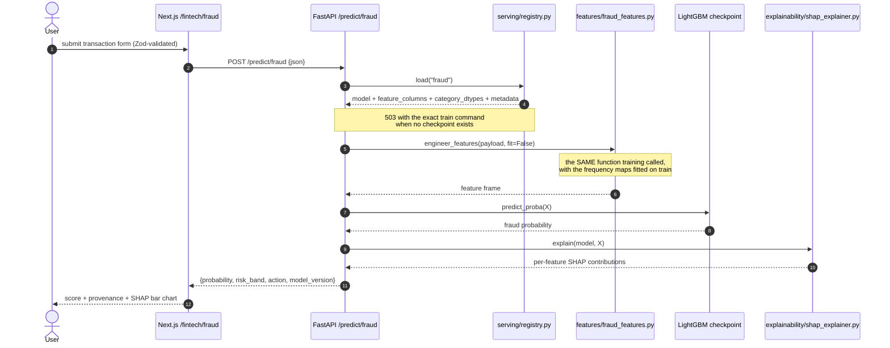
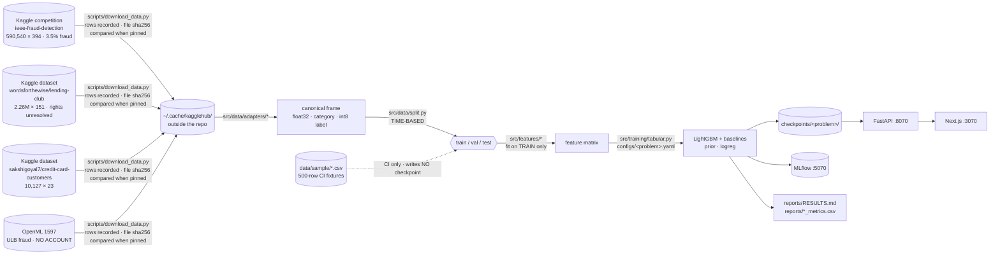

# Fintech ML System — Fraud, Credit Risk, and Attrition on Real Public Data

[](https://github.com/armandogon94/Portfolio-ML-System/actions/workflows/ci.yml)
[](#testing)
[](pyproject.toml)
[](LICENSE)

Three real-money fintech problems — payment fraud, consumer credit risk, and card
attrition — with two accepted real-data training runs, tracked in MLflow and
served behind a FastAPI inference API with SHAP explanations. It was rebuilt
from a version whose headline metric was real, reproducible, and completely
meaningless.

**Can a fraud model hold up when the labels aren't ones I wrote myself?**

- **Focus** — payment fraud · consumer credit risk · card attrition
- **Data** — [IEEE-CIS](https://www.kaggle.com/competitions/ieee-fraud-detection/data) (590,540 × 394, 3.5% fraud) · [LendingClub](https://www.kaggle.com/datasets/wordsforthewise/lending-club) (2.26M × 151; uploader tags CC0, upstream authority unverified) · [Credit Card Customers](https://www.kaggle.com/datasets/sakshigoyal7/credit-card-customers) (10,127 × 23; uploader tags CC0, upstream authority unverified)
- **Stack** — Python 3.11 · LightGBM · PyTorch (MPS) · SHAP · MLflow · FastAPI · Next.js 14 · Docker
- **Output** — a results table where every cell traces to a CSV written by a training run. That is now true for the two measured rows, `fraud_ulb` and `churn`; three rows remain empty because IEEE-CIS is credential-blocked, its autoencoder needs the same data, and LendingClub was not run.

📄 **[Read the full methodology & analysis →](reports/RESULTS.md)**

---

## A correction, and why it's here

An earlier version of this README reported **AUC-ROC 0.964** for fraud detection.
That number was real — it reproduced exactly from
`results/fraud_detection_metrics.csv` and from
`checkpoints/fraud_detection/metadata.json`, and every artefact agreed with it.

It was also meaningless. The dataset came from `src/data/generate_fraud.py`,
which drew fraudulent and normal transactions from **two different
distributions** and passed `is_fraud` into the generator as an **input** rather
than deriving it from the features:

```python
# src/data/generate_fraud.py:26,29  (deleted)
normal = _generate_transactions(rng, n_normal, is_fraud=False)
fraud  = _generate_transactions(rng, n_fraud,  is_fraud=True)

# src/data/generate_fraud.py:42,50  (deleted)
if is_fraud:  transaction_amount = rng.lognormal(mean=5.5, sigma=1.5, ...)
else:         transaction_amount = rng.lognormal(mean=3.5, sigma=1.0, ...)
```

The model's entire task was to separate `lognormal(5.5, 1.5)` from
`lognormal(3.5, 1.0)`. It was measuring how far apart I had put two of my own
random number generators. The credit-risk and housing targets had the same
defect: the label was a closed-form function of the features, which I wrote.

**All four published numbers are retracted** — fraud 0.964, credit risk 0.888,
housing R² 0.942, forecasting MAE 22.2. Every synthetic generator is deleted, and
`src/config.py` now raises at load time on any config that does not name a real,
downloadable dataset. Replacement results now use the metric appropriate to each
class balance and disclose what the underlying data can actually support.

Full reasoning, including the enforcement that stops this recurring:
**[ADR-0003 — Real public data only](docs/adr/0003-real-data-over-synthetic.md)**.

---

## Current status

**Two of five result rows are measured on real data: `fraud_ulb` and `churn`.**

The other three remain empty. IEEE-CIS is blocked because its competition
download needs a classic `kaggle.json` token rather than the working Kaggle OAuth
token; `fraud_autoencoder` needs the same data. LendingClub was not run, and its
648 MB download was not attempted in this session.

[`docs/PROGRESS.md`](docs/PROGRESS.md) lists exactly what is blocked, why, and the
commands to unblock it.

---

## Key Findings

- **The old fraud result was not a model result.** `generate_fraud.py` passed the
  label into the generator as a parameter, so 0.964 measured the separation
  between two hand-chosen lognormals. Retracted rather than quietly deleted.
- **The credential-free fraud result beat its logistic baseline on the metric
  that matters.** ULB/OpenML 1597 measured PR-AUC **0.8569 ± 0.0331** against
  **0.7300 ± 0.0279** for logistic regression, all out of fold.
- **The churn score is not prospective.** Its **0.9735 ± 0.0078 PR-AUC**
  substantially detects an attrition that already happened because current
  status and trailing-activity features describe the same period.
- **The old test suite could not have caught any of it.** 360 tests, 90%
  coverage, and `pyproject.toml` hid `-m 'not network and not parity'` inside
  `addopts` — silently deselecting both the Kaggle canary and the pre-ship gate.
  `tests/test_serving.py` asserted only key presence and `0 <= score <= 1`, which
  a predictor hardcoded to `0.5` passes. That exclusion is gone and the gates now
  assert the expected-range smoke alarm, baseline improvement, and monotonic
  direction.

## Results

```bash
uv run python scripts/train.py --model fraud_ulb   # no Kaggle account needed
uv run python scripts/evaluate.py --markdown
```

| Problem | Dataset (rows × cols, % positive) | Split | Model | PR-AUC ↑ | ROC-AUC ↑ | Baseline PR-AUC | Δ vs baseline | Source |
|---|---|---|---|---|---|---|---|---|
| Fraud | IEEE-CIS · 590,540 × 394 · 3.50% | time (`TransactionDT` 80/20) | LightGBM |  |  |  |  | `reports/fraud_metrics.csv` |
| Fraud (`fraud_ulb`, credential-free) | ULB / OpenML 1597 · 284,807 × 30 · 0.1727% | 5-fold stratified CV | LightGBM | **0.8569 ± 0.0331** | 0.9810 ± 0.0092 | 0.7300 ± 0.0279 | 0.1269 ± 0.0355 | [`reports/fraud_ulb_metrics.csv`](reports/fraud_ulb_metrics.csv) |
| Fraud (unsup. baseline) | IEEE-CIS · 590,540 × 394 · 3.50% | time (`TransactionDT` 80/20) | Autoencoder (MPS) |  |  |  |  | `reports/fraud_autoencoder_metrics.csv` |
| Credit risk | LendingClub · terminal statuses only | time (`issue_d`) | LightGBM |  |  |  |  | `reports/credit_risk_metrics.csv` |
| Churn | CC attrition · 10,127 × 23 · 16.07% | 5-fold stratified CV | LightGBM | **0.9735 ± 0.0078** | 0.9940 ± 0.0019 | 0.7800 ± 0.0217 | 0.1935 ± 0.0145 | [`reports/churn_metrics.csv`](reports/churn_metrics.csv) |

<sub>Two rows are measured; three remain empty. IEEE-CIS is blocked on a classic
`kaggle.json` competition token, the autoencoder needs that dataset, and the
LendingClub download was not attempted. `scripts/evaluate.py` reads every filled
cell from training-written `reports/*_metrics.csv`; it computes nothing. Full
config, caveats, and provenance:
[`reports/RESULTS.md`](reports/RESULTS.md).</sub>

<sub>For stratified cross-validation, the displayed and gated result is the CV
mean ± standard deviation. The serving checkpoint is refit on all rows, and the
curves/calibration/confusion matrix come from one persisted out-of-fold score per
row. The autoencoder uses raw reconstruction error for ranking metrics and its
training-set 95th-percentile threshold for hard decisions; it reports no Brier
score because that error is not a calibrated probability.</sub>

**Read PR-AUC first.** On ULB, ROC-AUC **0.9810 ± 0.0092** is inflated by the
**0.1727%** positive rate; the prior baseline gets **0.5000 ROC-AUC** but only
**0.0017 PR-AUC**. The informative comparison is **0.8569 ± 0.0331 PR-AUC**
against the logistic-regression baseline of **0.7300 ± 0.0279**.

**Do not read churn as forecasting.** `Attrition_Flag` is current status while
its strongest features summarise the same trailing activity window. With no
event timestamp, feature cutoff, or future outcome window, the dataset supports
detection of an attrition that already happened, not prospective prediction.

---

## Architecture



The API discovers models by globbing `checkpoints/*/metadata.json` rather than
holding a hardcoded list, so adding a model needs no change to `api.py` and no
redeploy — and a fresh clone with zero checkpoints reports `status: ok` with three
unavailable models instead of crash-looping.
[SVG](docs/diagrams/c4-container.svg) · [full notes](docs/architecture.md)

## How a prediction happens



Step 5 calls the *same* `engineer_features` training called, with the frequency
maps and category dtypes training fitted, loaded from the checkpoint.
Training/serving skew is the most common production ML bug and the only
structural defence is refusing to have a second implementation —
`tests/serving/test_skew.py` scores the same rows through both paths and demands
identical matrices. [SVG](docs/diagrams/sequence-predict.svg)

## Data pipeline



The split happens **before** feature engineering. Frequency encodings and group
aggregates are fitted on the training rows only; fitting them on the full frame
leaks the test distribution and is worth roughly a point of AUC that evaporates
in production. The dotted edge is the other load-bearing detail: fixtures reach
the trainer but open no tracking run and cannot reach `checkpoints/` or
`reports/`.
[SVG](docs/diagrams/pipeline-dag.svg)

There is **no ERD** here on purpose: this project has no application database.
The only durable state is MLflow's SQLite store, which is a vendor schema this
project does not own. [`docs/architecture.md`](docs/architecture.md) says so in
one line rather than drawing a fictional one.

---

## Repository Structure

```bash
07-Portfolio-ML-System/
├── configs/                    # 4 dataset configs across the closed 3-problem scope.
│   │                           #   Each names a real source, split, seed, and sanity band.
│   ├── fraud.yaml              #   IEEE-CIS · time split on TransactionDT
│   ├── fraud_ulb.yaml          #   OpenML 1597 · credential-free · time split on Time
│   ├── credit_risk.yaml        #   LendingClub · time split on issue_d · 28-column denylist
│   └── churn.yaml              #   Card attrition · 5-fold stratified CV
├── src/
│   ├── config.py               # Loads AND validates. Refuses a config with no real data.source.
│   ├── data/
│   │   ├── download.py         #   kaggle_dataset / kaggle_competition / openml. No fallback.
│   │   ├── split.py            #   Time-based by default; val sits between train and test.
│   │   └── adapters/           #   raw vendor columns -> canonical schema, one per dataset
│   ├── features/               # 4 dataset modules + schema.py. Training and serving share them.
│   ├── models/registry.py      # @register("lightgbm"). Unknown name -> KeyError listing valid ones.
│   ├── training/
│   │   ├── trainer.py          #   BaseTrainer: config, MLflow, W&B, model registry
│   │   ├── tabular.py          #   ONE config-driven trainer. Replaced 8 train_*.py files.
│   │   └── autoencoder_pipeline.py  # the unsupervised fraud baseline (the only MPS user)
│   ├── evaluation/             # PR-AUC primary; precision@k and recall@FPR for the ops framing
│   ├── explainability/         # SHAP (trees) + input gradients (autoencoder)
│   └── serving/                # registry · preprocessing · predictors/ · explain · handlers · api
│                               #   Every file under 150 lines. Was one 573-line monolith.
├── scripts/                    # download_data · train · evaluate · serve · make_figures
│                               #   make_fixtures · capture_screenshots · verify_fresh_clone.sh
├── data/
│   ├── README.md               # Provenance, licence, access gate, and the leakage traps per dataset
│   └── sample/                 # COMMITTED 500-row synthetic CI fixtures. Labels are pure noise.
├── tests/                      # Mirrors src/ package-for-package. 221 pass, 88% coverage.
│   ├── data/test_leakage_denylist.py   # the highest-value test in the repo
│   ├── serving/test_skew.py            # training features == serving features
│   ├── test_quality_gates.py           # sanity band, baseline improvement, monotonicity
│   └── e2e/test_train_to_serve.py      # fixtures -> train -> checkpoint -> HTTP, under 30s
├── web/                        # Next.js 14. Three routes + /dashboard. Zero placeholder copy.
├── infra/                      # docker/ multi-stage non-root images · compose/ 3-service stack
├── docs/                       # adr/ 0001-0005 · diagrams/ Mermaid + SVG · architecture.md
├── reports/                    # RESULTS.md + *_metrics.csv (written by training, never by hand)
├── conftest.py                 # AT ROOT ON PURPOSE — imports xgboost+lightgbm before torch (libomp)
└── uv.lock                     # COMMITTED. The Docker build fails without it.
```

---

## Quickstart

```bash
git clone https://github.com/armandogon94/Portfolio-ML-System.git
cd Portfolio-ML-System
cp .env.example .env

make setup           # uv sync --frozen --extra dev
make test            # test suite on committed fixtures — no credentials, no network
make train-sample    # smoke-train all 4 configs (opens no tracker; writes no artifacts)
```

**Everything above works with no Kaggle account and no network.** The fixture
path exists precisely so a reviewer can verify the pipeline before deciding
whether to sign up for anything.

To train on real data:

```bash
make data            # needs a Kaggle token — see data/README.md
make train
make evaluate        # reads reports/*_metrics.csv
make figures         # PR curves, calibration, SHAP -> reports/figures/
```

Credential-free real-data fraud path:

```bash
uv run python scripts/download_data.py --dataset ulb-creditcard
uv run python scripts/train.py --model fraud_ulb
uv run python scripts/evaluate.py --markdown
```

This fetches OpenML dataset 1597 through
`sklearn.datasets.fetch_openml(data_id=1597, as_frame=True)` and needs no Kaggle
account, token, or rules acceptance.

To run the stack:

```bash
make docker-up       # mlflow :5070 · api :8070 · web :3070
curl http://localhost:8070/health
open http://localhost:3070/dashboard
```

**Requires:** Python 3.11+, Docker 24+, pnpm 10 (for the web app only).

---

## Data & access

Four real datasets cover three business problems. The three Kaggle sources are
not anonymously downloadable; the OpenML source is:

| Dataset | Account | Extra gate | Redistributable |
|---|---|---|---|
| IEEE-CIS Fraud Detection | Free Kaggle | **Yes — one-click rules acceptance** | **No** |
| LendingClub 2007-2018Q4 | Free Kaggle | No | Uploader tags CC0; upstream authority unverified — do not redistribute rows |
| Credit Card Customers | Free Kaggle | No | Uploader tags CC0; upstream authority unverified — do not redistribute rows |
| ULB Credit Card Fraud (OpenML 1597) | **None** | No | Unresolved — OpenML records only "Public"; the Kaggle mirror indicates ODbL-style terms. Treat as NOT cleared for redistribution. |

IEEE-CIS sits behind a Kaggle account *and* an acceptance of the competition
rules that cannot be scripted. On this machine,
`~/.kaggle/access_token` authenticates Kaggle **datasets** but
`kagglehub.competition_download('ieee-fraud-detection')` still returns 403; the
competition path needs a classic `~/.kaggle/kaggle.json` API token. The
ULB/OpenML path needs **no account at all**, so a reviewer with zero Kaggle
presence can reproduce a real-data fraud result with the commands above.

Because IEEE-CIS competition data is not redistributable, **no real row from any
of these datasets is committed here.** The only data in git is `data/sample/` —
500-row synthetic fixtures whose labels are drawn independently of the features,
used by CI and by nothing else.

Full provenance, per-dataset column notes and both leakage traps:
[`data/README.md`](data/README.md).

---

## Reproducibility

- **Seed 42**, declared once per config and threaded into the split,
  preprocessing and every estimator by `BaseTrainer._seed_everything`, including
  PyTorch weight initialisation, dropout and shuffling. Seeded MPS kernels are not
  guaranteed bit-deterministic, and the code says so rather than claiming exact
  reproducibility.
- **`uv.lock` is committed** (758 KB). Before this, `.gitignore` hid it while
  `api.Dockerfile` ran `COPY pyproject.toml uv.lock ./` and `uv sync --frozen` —
  the advertised quickstart was physically unbuildable from a fresh clone.
  `scripts/verify_fresh_clone.sh` exists to keep that fixed.
- **Every checkpoint carries its own provenance.**
  `checkpoints/<problem>/metadata.json` records the git SHA that trained it, the
  seed, the dataset source, the split config, the full feature column list, every
  metric, the checkpoint fit scope and row count, and the enforced leakage
  controls. Autoencoder checkpoints write the same fields and the same metrics
  CSV path as tabular checkpoints.
- **`/predict` returns `model_version`** — the short git SHA from that metadata —
  on every response. A score with no provenance is unreviewable.
- **No number is typed by hand.** `scripts/evaluate.py` reads
  `reports/*_metrics.csv`; it computes nothing. There is no code path from a
  fixture to a published table: sample mode opens no MLflow/W&B run and writes
  no checkpoint or metrics CSV, while dashboard history requires
  `sample=false` plus matching problem/config tags.

## Explainability

Two explainers, dispatched on the checkpoint's model type by
[`src/serving/explain.py`](src/serving/explain.py):

- **SHAP `TreeExplainer`** for LightGBM and XGBoost — exact, fast enough for a
  request path, and returns signed per-feature contributions.
- **Input-gradient attribution** for the autoencoder baseline, because
  `TreeExplainer` does not apply and `KernelExplainer` on a 12-layer MLP is far
  too slow to serve.

An unknown model type raises `NotImplementedError` → HTTP 501 rather than
returning an empty explanation that a UI would render as "no important features".

The `/explain/*` routes reuse the exact feature frame the score was computed
from, so the explanation always describes the number beside it.

## Testing

```bash
make test       # 221 pass, excludes the live-Kaggle canary
make test-all   # includes it (needs credentials)
make lint typecheck
make verify     # clone HEAD into a temp dir and run this README's quickstart
```

**221 passed · 17 skipped · 88% coverage on `src/`.** The 17 skips are the quality
gates, which need a real checkpoint and skip with the command that creates one —
skipping is correct; a vacuously passing gate is not.

What the gates assert, beyond plumbing:

| Test | Assertion |
|---|---|
| [`tests/data/test_leakage_denylist.py`](tests/data/test_leakage_denylist.py) | No post-origination LendingClub column and neither `Naive_Bayes_Classifier_*` column reaches a model matrix |
| [`tests/training/test_split.py`](tests/training/test_split.py) | Equal timestamps stay in the earlier partition; train, validation, and test timestamp sets are disjoint |
| [`tests/serving/test_skew.py`](tests/serving/test_skew.py) | Serving features == training features, row for row, on a fixture batch |
| [`tests/test_quality_gates.py`](tests/test_quality_gates.py) | Expected-range smoke alarm, model beats its own baseline, monotonic direction |
| [`tests/e2e/test_train_to_serve.py`](tests/e2e/test_train_to_serve.py) | Fixtures → train → checkpoint → HTTP predict in under 30s, and asserts the fixture result is **near chance** |

`pyproject.toml` no longer hides `-m 'not network and not parity'` in `addopts`.
The network exclusion now lives visibly in
[`.github/workflows/ci.yml`](.github/workflows/ci.yml).

---

## Limitations & Known Caveats

- **Only two of five rows are measured.** ULB/OpenML and churn have accepted
  out-of-fold results. IEEE-CIS remains credential-blocked, its autoencoder needs
  the same data, and LendingClub was not run.
- **IEEE-CIS test labels do not exist.** The competition's `test_transaction.csv`
  is unlabelled, so evaluation is a temporal split *within* the training file.
  That is the only honest option, and a random split would inflate AUC by putting
  the same card and device on both sides of the boundary.
- **Churn is not prospective.** `Attrition_Flag` and the trailing-activity
  features describe the same period. The source has no event timestamp, feature
  cutoff, or future outcome window, so the score substantially detects attrition
  that already happened.
- **The churn checkpoint fails one directional serving gate.** On the existing
  fixed probe, more inactivity lowers the score. The test remains enabled; the
  out-of-fold ranking result is published, but the serving score is not a
  monotonic retention policy.
- **The credit-risk thresholds are illustrative, not a credit policy.** A real
  approve/decline cut point comes from expected loss at a target approval rate,
  which needs a pricing model this repository does not contain.
- **MPS on the host, CPU in Docker.** `src/device.py` selects MPS on Apple
  Silicon, but `infra/docker/api.Dockerfile` force-installs CPU PyTorch — MPS is
  macOS-only and cannot exist in a Linux container. LightGBM and XGBoost ship
  CPU-only wheels on macOS arm64 regardless, so the three headline models gain
  nothing from MPS either way.
- **No deployment.** Zero cloud budget, and no dead "Live:" link. Docker plus the
  committed screenshot script is the demo.
- **`docs/images/` is empty.** `scripts/capture_screenshots.py` is committed and
  regenerable, but screenshots were not generated in this results-publication
  pass.

## Tech decisions

| ADR | Decision |
|---|---|
| [0001](docs/adr/0001-gradio-to-nextjs.md) | Gradio → Next.js + shadcn/ui. Gradio could not do per-model deep links or bespoke result cards, and every Gradio app looks like a research prototype. |
| [0002](docs/adr/0002-experiment-tracking.md) | MLflow is primary for real runs; sample runs are deliberately untracked. W&B remains optional. |
| [0003](docs/adr/0003-real-data-over-synthetic.md) | **Real public data only.** Every generator deleted, the config loader enforces it, and the old 0.964 is publicly retracted with its mechanism stated. |
| [0004](docs/adr/0004-narrow-to-fintech.md) | Ten industries → three fintech problems. Twenty-one catalogued models over four checkpoints was breadth as a tell, not as range. |
| [0005](docs/adr/0005-assumptions-log.md) | Assumptions taken during the autonomous rebuild, each reversible in one commit. |

## License

- Repository licence: MIT — see [LICENSE](LICENSE).
- Third-party notices: [THIRD_PARTY_NOTICES.md](THIRD_PARTY_NOTICES.md).

## Author

**Armando Gonzalez** — ex-software engineer at a fintech company, finishing an
M.S. in Data Science & AI at FIU.
[GitHub](https://github.com/armandogon94)
