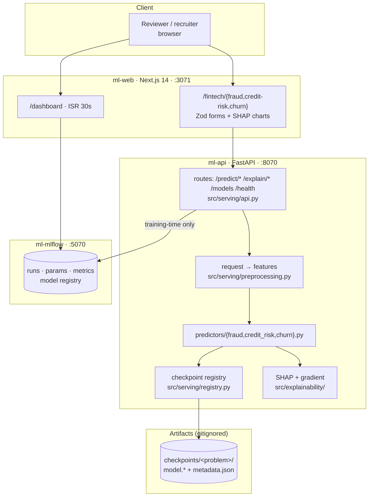
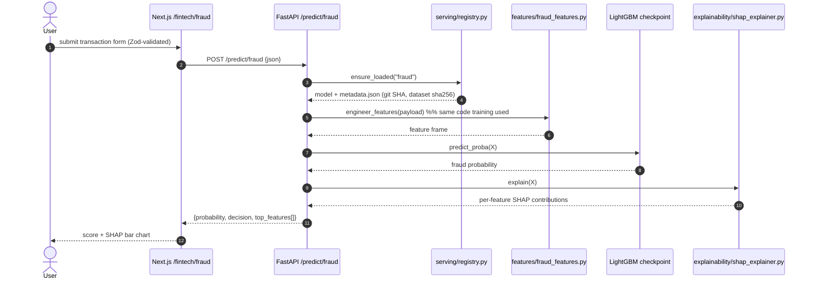
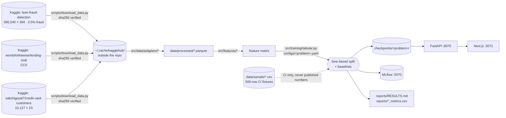

# AGENT BRIEF — 07-Portfolio-ML-System

> **Read this file top to bottom before touching anything.** It is the complete execution plan.
> Everything asserted here was verified against the working tree on 2026-07-24 at commit `8809503`
> (`v1.4.0-phase-a-complete`, 84 commits, remote `https://github.com/armandogon94/Portfolio-ML-System`,
> **already PUBLIC**). File:line citations are real — open them before you argue with them.
>
> **Priority: P1.** This is the highest-impact rebuild in the portfolio.
> **Owner:** Armando Gonzalez — ex-software-engineer at a fintech company, finishing M.S. Data Science & AI (FIU).
> **Primary target role: AI/ML Engineer.** Secondary: Data Engineer, Data Scientist. **Not** frontend.
> **Hardware budget:** MacBook Pro, 32 GB RAM, ~150 GB free disk, Apple Silicon (MPS, no CUDA). **Zero cloud budget.**

---

## 1. Mission

This repo is a **fintech ML system**: three real-money problems — payment fraud, consumer credit risk, and
credit-card customer attrition — each trained on a **real, public, downloadable dataset**, tracked in MLflow,
served behind a FastAPI inference API with SHAP explanations, and demonstrated in a Next.js dashboard.
It is written for one reader: a hiring manager screening for AI/ML Engineer who will spend ninety seconds
deciding whether the numbers in the README mean anything.

**Done means:** every headline metric in `README.md` was measured on data a stranger can download with
documented commands, reproduced by one `make` target from a fresh clone, and traceable to a committed
`reports/RESULTS.md` row and a `checkpoints/*/metadata.json` written by a specific commit — with the old,
invalid `0.964` explicitly retracted in the README rather than quietly deleted.

---

## 2. Current state — verified, no softening

### 2.1 The kill shot: the headline metric measures nothing

`src/data/generate_fraud.py` does not generate transactions and then label them. It generates **two
different populations from two different distributions** and staples the label on as an *input*:

```python
# src/data/generate_fraud.py:22-29
n_fraud  = int(n_samples * 0.02)
n_normal = n_samples - n_fraud
normal = _generate_transactions(rng, n_normal, is_fraud=False)   # line 26
fraud  = _generate_transactions(rng, n_fraud,  is_fraud=True)    # line 29

# src/data/generate_fraud.py:37-56
def _generate_transactions(rng, n, is_fraud: bool) -> pd.DataFrame:   # line 37
    if is_fraud:                                                       # line 40
        transaction_amount   = rng.lognormal(mean=5.5, sigma=1.5, ...) # line 42
        distance_from_home   = rng.exponential(80, n)...               # line 44
        is_online            = rng.binomial(1, 0.7, n)                 # line 45
    else:
        transaction_amount   = rng.lognormal(mean=3.5, sigma=1.0, ...) # line 50
        distance_from_home   = rng.exponential(10, n)...               # line 52
        is_online            = rng.binomial(1, 0.3, n)                 # line 53
```

`is_fraud` is a **function parameter**, not a derived outcome. Any classifier's job is therefore to
separate `lognormal(5.5, 1.5)` from `lognormal(3.5, 1.0)`. `README.md:18` advertises the result of that
exercise as:

| Problem | Algorithm | Key Metric | Score |
|---|---|---|---|
| Fraud Detection | PyTorch Autoencoder + Isolation Forest | AUC-ROC | **0.964** |

**The number is not fabricated — it is worse than that: it is real and meaningless.** It reproduces exactly:
`results/fraud_detection_metrics.csv` → `test_autoencoder_auc_roc,0.9641320471938776`, and
`checkpoints/fraud_detection/metadata.json` carries the same value. Verified by direct read.
Verified by direct count of `data/raw/fraud_transactions.csv`: **200,000 rows, 4,000 positives, exactly 2.00%** —
produced by `scripts/generate_data.py` per `configs/fraud_detection.yaml:4-6`.

**This is live in a public README right now.**

### 2.2 The same defect spans every problem in the repo

All 10 files in `configs/*.yaml` point `data.raw_data_path` at a generator's output. Nine of them declare no
external data source at all; only `configs/price_prediction.yaml:12` declares a `kaggle_slug`.

| Generator | Label construction | Line |
|---|---|---|
| `src/data/generate_credit_risk.py` | `z = -3.0 + 0.02*(40-age) - 1.5*((credit_score-680)/100) + ...` then `default_prob = 1/(1+exp(-z))`, `is_default = rng.random() < default_prob` | 50-63 |
| `src/data/generate_customer_churn.py` | same shape: hand-tuned logistic score → `churn_prob = 1/(1+np.exp(-z))` → Bernoulli draw | 71-86 |
| `src/data/generate_fraud.py` | two-population split, `is_fraud` passed in | 22-56 |
| `src/data/generate_housing.py` | polynomial price × `rng.normal(1.0, 0.10)` — the published `R² 0.942` is roughly the arithmetic ceiling of 10% injected noise | ~52-70 |

XGBoost recovering a logistic function that the author wrote is not a credit model. It is a unit test for
`model.fit()`. `README.md:255` says only *"All datasets are **synthetic**"* — it never says the labels are a
closed-form function of the features, which is the part that voids the metrics.

### 2.3 The advertised real-data differentiator was never run

`README.md:80-96` sells a three-modality (`synthetic` / `stream` / `mixed`) real-Kaggle training system with
automatic winner selection and `results/modality_comparison_<problem>.csv` output.

- `ls results/ | grep -i modality` → **no matches** (verified, exit 1).
- `ls checkpoints/` → `credit_risk demand_forecasting fraud_detection price_prediction` — **no `_stream` or
  `_mixed` directory anywhere**.
- 1 of 10 configs declares `kaggle_slug`.
- `src/data/stream.py:47` calls `kagglehub.dataset_download(slug)` only — there is **no competition-download
  path at all**, so the machinery physically cannot fetch a Kaggle *competition* dataset.

The flagship differentiator is scaffolding.

### 2.4 Verified false or dead claims (each confirmed by me, this session)

| # | Claim | Evidence it is false |
|---|---|---|
| 1 | `README.md:18` "Fraud Detection · AUC-ROC · 0.964" as a model result | `src/data/generate_fraud.py:26,29,37,40` — label is a generator input (§2.1) |
| 2 | `README.md:17,19,20` credit-risk 0.888 / price R² 0.942 / MAE 22.2 | `generate_credit_risk.py:50-63`, `generate_housing.py:52-70` — labels are closed-form functions |
| 3 | `README.md:7` `[![License: MIT]](LICENSE)` badge | `ls LICENSE*` → **no matches**. Dead link; repo is legally all-rights-reserved |
| 4 | `README.md:54` `git clone https://github.com/YOUR_USERNAME/portfolio-ml-system.git` | Unreplaced template placeholder in a **public** repo. Real remote: `armandogon94/Portfolio-ML-System` |
| 5 | `README.md:65` `make docker-up` as the quickstart | `.gitignore:16` ignores `uv.lock`; `git ls-files \| grep -c uv.lock` → **0**; `Dockerfile.api:22` does `COPY pyproject.toml uv.lock ./` and `:25` runs `uv sync --frozen`. **Fresh clone cannot build.** The 758 KB `uv.lock` exists on disk, untracked |
| 6 | `README.md:229-239` API at `:8000` with 4 curl examples | `docker-compose.yml:45` maps `${BACKEND_PORT:-8070}:8000`; `README.md:74` and `.env.example` say 8070. Every curl in the README fails as written |
| 7 | `README.md:206` "sortable table of all 20 cataloged models" | `web/lib/industries.ts`: 11 `ready: true`, 10 `ready: false`, **8 literal `TODO(copy)` markers**. Ten rows never resolve |
| 8 | Six of ten models can serve | `checkpoints/` holds 4 problems. `src/serving/predictor.py:68-69` raises `FileNotFoundError` for the rest, while `src/serving/api.py` exposes 21 routes |
| 9 | `README.md:206`/`README.md:40` "all 20" vs `CLAUDE.md` "10 models" vs 4-row metrics table | Three different counts in one repo |
| 10 | Tests prove rigor | `pyproject.toml` `addopts = "... -m 'not network and not parity'"` deselects both the parity gate and the Kaggle canary. `tests/test_parity_gradio_nextjs.py` additionally self-skips without checkpoints. `tests/test_serving.py` asserts only key presence and `0 <= score <= 1` — a predictor hardcoded to `0.5` passes the suite |
| 11 | CI exists | `.github/workflows/` is an **empty directory** (verified: `find .github` returns only the two dirs). 84 commits, 360 tests, zero CI |
| 12 | Repo is clean | `docker-compose.dev.bak.yml` is **tracked in git**. `.claude/rules/python-env.md`, `.claude/settings.json`, `.claude/settings.local.json` are **tracked** (must not be). Root carries `AGENTS.md`, `PLAN.md`, `PORT-MAP.md`, `PORTS.md`, `SPEC.md` (65 KB), `decision.md`, `tasks/`, plus seven untracked `.coverage 2..7` duplicates and a broken git ref `.git/refs/remotes/origin/HEAD 2` (produces a warning on every `git branch -a`) |
| 13 | Visual demo | Zero images tracked. `grep -c mermaid README.md` → 0. `README.md:26-41` is misaligned ASCII with a dangling `...` row |

### 2.5 What is genuinely good — **do not destroy any of this**

Verified real, working, and worth keeping:

- **Config-driven training.** `src/training/trainer.py` (375 lines) — `BaseTrainer` ABC owning config load, MLflow +
  optional W&B init, checkpointing, results CSV export. Subclasses implement `load_data / preprocess / train / evaluate`.
- **MLflow model registry** — `src/training/trainer.py:193-195` (`MlflowClient().create_registered_model(...)`).
- **Dynamic checkpoint-driven model registry** — `ModelPredictor.get_model_info()` (`src/serving/predictor.py:295`)
  discovers models from `checkpoints/*/metadata.json`, so adding a model needs no serving change.
- **Real explainability** — `src/explainability/shap_explainer.py` + `gradient_explainer.py`, wired to 10
  `/explain/*` routes in `src/serving/api.py:212-320` and rendered by `web/components/ExplainabilityChart.tsx`.
- **Structured JSON logging** — `src/logging_config.py`, `LOG_FORMAT=json|text`.
- **MPS support** — `src/device.py` auto-detects MPS > CUDA > CPU.
- **Next.js 14 dashboard** — `web/` with 91 Vitest tests, ISR dashboard, Zod-validated forms, MLflow sparklines.
- **Docker** — multi-stage non-root `Dockerfile.api`, 3-service compose with healthchecks.
- **`uv.lock` already exists on disk (758 KB)** — it is only gitignored, not missing.
- `grep -rnE 'random|fake|dummy|return 0\.5|hardcod' src/serving/` → **zero hits.** The serving path is honest.

---

## 3. Original intent vs. what was built

### 3.1 The table

Sources read: `SPEC.md` (65 KB, three appended specs: Production Hardening, Phase A.1 Streaming, Phase A.2/A.9 Next.js),
`decision.md` (7 decisions), `tasks/plan.md`, `tasks/todo.md`, `PLAN.md`, `.handoff/HANDOFF.md`.

| # | Originally specified | Where | Built? | Evidence | Verdict |
|---|---|---|---|---|---|
| 1 | `docker compose up --build` → 3 services healthy in 90 s | `SPEC.md:427` | Yes, but **dead on fresh clone** | `.gitignore:16` vs `Dockerfile.api:22,25` | **BUILD** — commit `uv.lock` (Slice 1) |
| 2 | `curl :8070/health` returns model availability | `SPEC.md:428` | Yes | `src/serving/api.py:324` | **KEEP** — fix README's `:8000` |
| 3 | All `/predict/*` return valid JSON | `SPEC.md:429` | Partially — 4 of 10 checkpoints exist | `src/serving/predictor.py:68` | **BUILD** — narrowing to 3 fintech models makes this 3/3 |
| 4 | MLflow registry with version history at `:5070` | `SPEC.md:430`, `decision.md` Decision 1 | Code exists, **never shown** | `trainer.py:193-195`; no screenshot, no README section | **BUILD** — re-register on real runs, screenshot it |
| 5 | `/explain/*` returns SHAP values | `SPEC.md:431` | Yes | `api.py:212-320`, `src/explainability/` | **KEEP** — becomes a headline (real features → interpretable SHAP) |
| 6 | Gradio UI, all tabs functional (`:3070`) | `SPEC.md:432` | Superseded by Next.js in A.9 | `docs/decisions/ADR-001-gradio-to-nextjs.md` (208 lines, Accepted) | **KEEP the ADR** → `docs/adr/0001-gradio-to-nextjs.md` |
| 7 | `make test` → 80 %+ coverage, zero failures | `SPEC.md:433` | Yes — 360 tests, 90 % | `tasks/todo.md` final verification | **BUILD** — tests assert plumbing, not correctness (§2.4 #10) |
| 8 | Structured JSON logs | `SPEC.md:434` | Yes | `src/logging_config.py` | **KEEP** — document it, it is currently invisible |
| 9 | `make lint` → zero warnings | `SPEC.md:435` | Yes | ruff configured in `pyproject.toml` | **KEEP** — add mypy |
| 10 | **Phase A.1: three-modality real-Kaggle training with automatic winner selection** | `SPEC.md:469-485,705-720` | **NO** | 1/10 configs has `kaggle_slug`; no `modality_comparison_*.csv`; no `*_stream`/`*_mixed` checkpoints; `stream.py:47` has no competition path | **DROP THE CLAIM, BUILD THE INTENT** — real data becomes the *only* path. Delete `--modality`, keep `stream.py` as the downloader (Slice 3) |
| 11 | Phase A.1 acceptance: `price --modality stream` downloads Zillow data | `SPEC.md:708` | No | no `_stream` checkpoint | **DROP** — `price_prediction` is deleted in the narrowing |
| 12 | Phase A.2/A.9: Next.js UI, 10 model pages + `/dashboard` | `SPEC.md:729+`, `tasks/todo.md` | Yes | `web/app/**` 10 routes + dashboard, 91 web tests | **KEEP 3, DELETE 7** — 10 of 21 catalog rows are permanent placeholders with `TODO(copy)` taglines |
| 13 | A.9 parity snapshot gate as pre-ship rigor | `tasks/todo.md` A.9.d | Built, **triple-gated into never running** | `pyproject.toml` addopts; `tests/test_parity_gradio_nextjs.py:116` self-skip | **DROP** — delete the file; it guards a UI that no longer exists |
| 14 | Phase B — remaining 9 industry models | `SPEC.md:1108` | Never started | `web/lib/industries.ts` 10× `ready: false` | **DROP** — directly contradicts the narrowing |
| 15 | Phase C — Vercel deploy, Playwright E2E, analytics | `SPEC.md:1011,1079-1080` | Never started | `tasks/todo.md` ends at Phase A | **DROP** — zero cloud budget. Docker + screenshots are the demo. **No dead "Live:" link in the README** |
| 16 | `README.md:9` "Built to run on Apple Silicon with MPS" | README | True on host; `Dockerfile.api:28` force-reinstalls CPU torch | — | **KEEP + qualify** — one honest sentence, not a section |
| 17 | MIT licence (badge + `pyproject.toml:license`) | `README.md:7`, `pyproject.toml:7` | **File absent** | `ls LICENSE*` no matches | **BUILD** — add `LICENSE` (Slice 1) |

### 3.2 Unmerged work — findings (B)

Checked `git branch -a`, `git worktree list`, `git stash list`, `ls .claude/worktrees/`:

| Location | Content | Salvage? |
|---|---|---|
| `git branch -a` | `main`, `remotes/origin/main`, `remotes/origin/HEAD` only. **No feature branches.** | Nothing to merge |
| `git worktree list` | One entry: the repo itself on `main` at `8809503`. No detached worktrees | Nothing |
| `.claude/worktrees/agent-a5a4ec3f/` | Directory tree `agent-a5a4ec3f/web` containing **zero files** (`du -sh` → `0B`) | **No.** Delete |
| `git stash list` | `stash@{0}: WIP on worktree-agent-af174e1f09e9654b0` — `git stash show --stat` = **`.claude/settings.local.json` only, +3/−1** | **No.** Drop it |
| `.handoff/` (untracked, not gitignored) | `HANDOFF.md` + `SCRATCH.md`. Genuinely useful facts already extracted into this brief (orphan `.bak` file, stale `PORT-MAP.md` Gradio refs at ~148-247, MLflow SQLite absolute-`artifact_uri` risk after the folder move) | **Facts salvaged here.** Delete the directory, add `.handoff/` to `.gitignore` |
| Working tree | 2 dirty entries: ` M .claude/settings.local.json`, `?? .handoff/`. **No uncommitted source work.** | Safe to proceed |
| `.git/refs/remotes/origin/HEAD 2` | Finder-copy artifact producing `warning: ignoring ref with broken name` on every `git branch -a`. Also seven `.coverage 2..7` duplicates in the root | Delete both (Slice 1) |

**Conclusion: nothing valuable is unmerged.** The working tree at `8809503` is the whole project.

---

## 4. Target layout

Derived from `PORTFOLIO-STRUCTURE-PLAN.md` §4.1 (`ml-research`) and `REFERENCE-STYLE-GUIDE.md` Templates A + C,
narrowed to three fintech problems.

```bash
07-Portfolio-ML-System/
├── README.md                       # ONE narrative entrypoint. Every claim backed by a file. §7 is the spec.
├── LICENSE                         # MIT. Currently ABSENT while a badge links to it.
├── Makefile                        # setup | data | train | evaluate | serve | test | lint | figures | docker-* | web-*
├── pyproject.toml                  # + mypy config, + dev/docs groups. Ports stay in .env.example.
├── uv.lock                         # ★ COMMITTED. Un-ignore it — `make docker-up` cannot build without it.
├── .python-version                 # 3.11 (already correct)
├── .env.example                    # BACKEND_PORT=8070 WEB_PORT=3071 MLFLOW_TRACKING_PORT=5070 (repo-local defaults)
├── .gitignore                      # + .claude/ (ENTIRE, incl. worktrees), .handoff/, artifacts/, .coverage*
├── conftest.py                     # KEEP AT ROOT — imports xgboost+lightgbm before torch (macOS libomp). Say why in README.
│
├── .github/workflows/
│   └── ci.yml                      # ★ NEW — dir exists and is EMPTY today. Full YAML in §8.
│
├── configs/                        # EXACTLY 3 files. Every one declares seed + a real `data.source`.
│   ├── fraud.yaml                  #   IEEE-CIS. time-based split on TransactionDT.
│   ├── credit_risk.yaml            #   LendingClub. time-based split on issue_d. Leakage denylist lives here.
│   └── churn.yaml                  #   Credit-card attrition. 5-fold stratified CV (n=10,127 — too small for one split).
│
├── src/
│   ├── config.py  device.py  logging_config.py          # KEEP AS-IS
│   ├── data/
│   │   ├── download.py             # ← renamed from stream.py. + competition_download branch for IEEE-CIS.
│   │   ├── kaggle_credentials.py   # KEEP AS-IS (env or ~/.kaggle/kaggle.json resolver)
│   │   ├── adapters/               # one module per dataset: raw columns → the repo's canonical schema
│   │   │   ├── ieee_cis.py  lending_club.py  credit_card_churn.py
│   │   └── preprocess.py           # KEEP
│   ├── features/                   # fraud_features.py · credit_risk_features.py · churn_features.py  (3, not 10)
│   ├── models/
│   │   ├── registry.py             # ★ NEW — @register("lightgbm"|"xgboost"|"logreg") → create_model(cfg)
│   │   └── autoencoder.py          # KEEP the MPS autoencoder as the UNSUPERVISED fraud BASELINE
│   ├── training/
│   │   ├── trainer.py              # BaseTrainer — KEEP (375 lines, genuinely good)
│   │   └── tabular.py              # ★ ONE config-driven trainer replacing 8 train_*.py files
│   ├── evaluation/                 # KEEP + add pr_auc, precision@k, cost-weighted metric
│   ├── explainability/             # KEEP AS-IS — shap_explainer.py + gradient_explainer.py
│   └── serving/
│       ├── api.py                  # FastAPI routes ONLY (3 predict + 3 explain + health + models)
│       ├── registry.py             # ★ split out — checkpoint discovery + lazy load
│       ├── preprocessing.py        # ★ split out — request dict → feature frame (SAME code training uses)
│       ├── explain.py              # ★ split out — SHAP/gradient dispatch
│       └── predictors/             # ★ split out — fraud.py · credit_risk.py · churn.py (≤150 lines each)
│                                   #   Replaces the 573-line src/serving/predictor.py monolith.
├── scripts/
│   ├── download_data.py            # ★ NEW — the single documented data entrypoint. Checksums. Actionable errors.
│   ├── train.py  evaluate.py  serve.py  run_all.py      # KEEP; strip --modality
│   └── make_figures.py             # ★ NEW — PR curves, calibration, SHAP summary → docs/diagrams/ + reports/figures/
│
├── data/
│   ├── README.md                   # ★ Data dictionary + provenance URL + licence + rows×cols + class balance + sha256
│   ├── sample/                     # ★ COMMITTED tiny fixtures (schema-shaped, ~500 rows, SYNTHETIC, CI-only)
│   │   ├── ieee_cis_sample.csv  lending_club_sample.csv  churn_sample.csv
│   └── raw/  processed/            # GITIGNORED
│
├── checkpoints/<problem>/          # GITIGNORED. model.* + metadata.json (metrics, params, git SHA, dataset sha256)
├── reports/
│   ├── RESULTS.md                  # ★ THE deliverable. Per-problem: data, split, baseline, model, error analysis.
│   ├── *_metrics.csv               # committed, source of the README table
│   └── figures/                    # regenerated by `make figures`, never hand-exported
│
├── docs/
│   ├── AGENT-BRIEF.md              # this file
│   ├── architecture.md             # the Mermaid diagrams in full
│   ├── ports.example.md            # ★ PLACEHOLDER port convention only (real values → gitignored ops/ports.local.md)
│   ├── diagrams/                   # ★ exported .svg for every Mermaid block in the README
│   └── adr/
│       ├── 0001-gradio-to-nextjs.md        # ← git mv from docs/decisions/ADR-001-*.md
│       ├── 0002-experiment-tracking.md     # ← from decision.md Decision 1 (MLflow primary + W&B optional)
│       ├── 0003-real-data-over-synthetic.md# ★ NEW — THE headline ADR. Why 0.964 was retracted.
│       └── 0004-narrow-to-fintech.md       # ★ NEW — why 10 domains became 3
│
├── infra/
│   ├── docker/{api,web}.Dockerfile # ← git mv from Dockerfile.api / Dockerfile.web
│   └── compose/{base,dev,prod}.yml # ← git mv from docker-compose*.yml (dev.bak.yml DELETED)
│
├── tests/                          # MIRRORS src/ package-for-package
│   ├── data/ features/ models/ training/ evaluation/ explainability/
│   ├── serving/{test_registry,test_preprocessing,test_predictors,test_api}.py
│   ├── test_quality_gates.py       # ★ metric floors + monotonicity — the tests that would catch a broken model
│   └── e2e/test_train_to_serve.py  # ★ fixture data → train → checkpoint → predict, < 30 s
│
├── web/                            # KEEP. Narrow to /, /fintech/{fraud,credit-risk,churn}, /dashboard.
└── ops/ports.local.md              # GITIGNORED — real port values live here only
```

**Deleted outright:** `AGENTS.md`, `PLAN.md`, `PORT-MAP.md`, `PORTS.md`, `SPEC.md`, `decision.md` (content
migrated to ADRs), `CLAUDE.md` (→ gitignored `.claude/`), `tasks/`, `.handoff/`, `docker-compose.dev.bak.yml`,
7 unrelated domains across `src/data`, `src/features`, `src/models`, `src/training`, `configs/`, `tests/`,
`web/app/`, `results/`.

---

## 5. Execution plan — vertical slices

Work on a branch: `git switch -c rebuild/fintech-real-data`. **Commit after every slice** (conventional commits,
no `Co-Authored-By` trailer — see the owner's global rules). Cheap, visible deletions come first.

---

### Slice 1 — Trust-signal repairs (~45 min, highest leverage in the repo)

**Goal:** make the advertised quickstart physically buildable and stop the repo from reading as never-reviewed.

**Files:** `.gitignore`, `uv.lock`, `LICENSE`, `README.md` (lines 7, 54, 229-239 only), `.git/refs/`, root cleanup.

1. Delete `.gitignore:16` (`uv.lock`) and `git add -f uv.lock` (758 KB, already on disk). This alone fixes
   `Dockerfile.api:22,25`.
2. Add `LICENSE` — MIT, `Copyright (c) 2026 Armando Gonzalez`.
3. Add `.claude/` (entire, including `worktrees/`), `.handoff/`, `.coverage*`, `artifacts/` to `.gitignore`;
   `git rm -r --cached .claude`.
4. `git rm docker-compose.dev.bak.yml`; delete the seven `.coverage 2..7` files and the broken ref
   `.git/refs/remotes/origin/HEAD 2`.
5. In `README.md` only: replace `YOUR_USERNAME` → `armandogon94` and repo slug → `Portfolio-ML-System`;
   change every `:8000` to `:8070`. (Full rewrite is Slice 9 — this is triage so the live README stops lying today.)

**Verification:**
```bash
git ls-files | grep -c uv.lock          # → 1
git ls-files | grep -c '^\.claude/'     # → 0
ls LICENSE                              # → LICENSE
git branch -a 2>&1 | grep -c warning    # → 0
rm -rf /tmp/clonetest && git clone . /tmp/clonetest && cd /tmp/clonetest && \
  docker compose -f infra/compose/base.yml build ml-api   # → builds (was: fails at COPY uv.lock)
```

---

### Slice 2 — Delete the seven non-fintech domains (~1 h, most visible progress)

**Goal:** the repo reads as fintech depth, not generated breadth. Ten unrelated industries is a tell.

**Delete** (`git rm`): `heart_disease`, `h1b_approval`, `dental_noshow`, `delivery_eta`, `rental_price`,
`demand_forecasting`, `price_prediction` across:
`configs/*.yaml` · `src/data/generate_*.py` · `src/data/adapters/housing_adapter.py` · `src/features/*` ·
`src/models/{price_model,lstm_forecaster}.py` · `src/training/train_*.py` · `tests/test_*.py` ·
`web/app/{healthcare,legal,dental,logistics,real-estate}/` · `web/__tests__/app/*` · `results/*_metrics.csv`.

Also delete now: `tests/test_parity_gradio_nextjs.py` (guards a deleted Gradio UI, never runs),
`src/data/modality.py`, and the `--modality` flag in `scripts/train.py` (§3.1 #10).

**Rewrite:** `web/lib/industries.ts` → exactly 3 entries, all `ready: true`, **zero `TODO(copy)`**,
real one-line taglines. `src/serving/api.py` → 3 predict + 3 explain + `/health` + `/models`.

**Verification:**
```bash
ls configs/ | wc -l                                  # → 3
grep -rc "TODO(copy)" web/lib/industries.ts          # → 0
grep -rn "heart_disease\|h1b\|dental\|delivery_eta\|rental\|demand_forecast\|price_prediction" \
  src/ configs/ web/ scripts/ tests/ --include='*.py' --include='*.ts' --include='*.tsx' --include='*.yaml' | wc -l   # → 0
uv run pytest -q                                     # green (fewer tests — expected)
cd web && pnpm test && pnpm typecheck && pnpm build   # green; route count drops to 3 + dashboard
```

---

### Slice 3 — Real data acquisition layer (~3 h)

**Goal:** one documented command downloads real public data; CI never needs it.

**Datasets — researched and specified. Do not substitute without recording an ADR.**

| Problem | Dataset | Scale | Licence / access | Command |
|---|---|---|---|---|
| **Fraud** (headline) | **IEEE-CIS Fraud Detection** (Vesta Corporation real e-commerce payments) — `ieee-fraud-detection` | `train_transaction.csv` **590,540 rows × 394 cols** + `train_identity.csv` (~144 k rows × 41 cols); **~3.5 % fraud** (20,663 positives); ≈118 MB zipped, ≈1.35 GB expanded | Kaggle **competition** — free account **plus one-click acceptance of the competition rules**. Competition data may not be redistributed → **never commit a slice of it** | `kaggle competitions download -c ieee-fraud-detection -p data/raw/` |
| **Credit risk** | **LendingClub accepted loans 2007-2018Q4** — `wordsforthewise/lending-club`, file `accepted_2007_to_2018Q4.csv.gz` | ~2.26 M rows × 151 cols, ≈648 MB gzipped | **CC0 / public domain**, Kaggle *dataset* (account only, no rules gate) | `kagglehub.dataset_download("wordsforthewise/lending-club")` |
| **Churn** | **Credit Card Customers (bank attrition)** — `sakshigoyal7/credit-card-customers` | **10,127 rows × 23 cols**, ~16 % attrited, < 2 MB | Kaggle dataset, account only | `kagglehub.dataset_download("sakshigoyal7/credit-card-customers")` |
| **Ungated fallback (fraud)** | **ULB Credit Card Fraud** — 284,807 transactions, 492 frauds (**0.172 %**), PCA features V1–V28 | ~150 MB | **DbCL 1.0** — redistributable. Also on **OpenML id 1597**, fetchable with **zero credentials** via `sklearn.datasets.fetch_openml(data_id=1597)` | `uv run python scripts/download_data.py --dataset ulb-creditcard` |

**Access-gate honesty — write this into `data/README.md` verbatim in substance:** IEEE-CIS is public and free but
sits behind a free Kaggle account and a one-click rules acceptance; it is not anonymous-`curl`-able. The
**ULB / OpenML path requires no account at all**, so a reviewer with zero Kaggle presence can still reproduce a
real-data fraud result end to end. State both. Do not pretend IEEE-CIS is anonymous-downloadable.

**Build:**
- `scripts/download_data.py --dataset {ieee-cis,lending-club,cc-churn,ulb-creditcard,all}` — resolves creds via
  the existing `src/data/kaggle_credentials.py`, downloads to `~/.cache/kagglehub/` (outside the repo and the
  Docker build context), verifies `sha256`, writes row/col counts and the checksum into `data/README.md`'s table,
  and on failure prints the **exact** remediation (URL to accept rules, or where to put `kaggle.json`).
- `src/data/download.py` (renamed from `stream.py`): keep `kaggle_cached()`, **add `kaggle_competition_cached()`
  calling `kagglehub.competition_download(...)`** — the current code only has `dataset_download`
  (`src/data/stream.py:47`), which cannot fetch IEEE-CIS.
- `src/data/adapters/{ieee_cis,lending_club,credit_card_churn}.py` — raw → canonical schema, `float32`
  downcasting, categorical handling. **Memory budget: `float32` on 590,540 × 393 ≈ 0.93 GB — comfortable in 32 GB.**
  Use `usecols` on LendingClub; never load all 151 columns.
- `data/sample/*.csv` — ~500-row **schema-shaped synthetic fixtures**, clearly labelled in `data/README.md` as
  *"CI fixtures only — never used to compute any published number."* This is the only synthetic data that
  survives, and only because IEEE-CIS licensing forbids committing real rows.
- **Delete every `src/data/generate_*.py`** once adapters are green.

**Verification:**
```bash
uv run python scripts/download_data.py --dataset all
uv run python -c "
from src.data.adapters.ieee_cis import load
df = load()
print(df.shape, df.isFraud.mean())"     # → (590540, N) and ≈0.035
sha256sum ~/.cache/kagglehub/**/train_transaction.csv   # matches data/README.md
du -sh data/raw/                          # < 5 MB — real data never lands in the repo
```

---

### Slice 4 — Fraud on IEEE-CIS (~4 h) ★ the centrepiece

**Goal:** replace `0.964` with an honestly measured number.

- **Split: time-based on `TransactionDT`.** Train = first 80 % of the time range, test = last 20 %.
  The competition's own `test_transaction.csv` has **no labels**, so a temporal split of the training file is the
  only honest option. **A random split inflates AUC** (the same card/device appears on both sides) — say so in
  `reports/RESULTS.md`; that sentence is a hiring signal.
- **Baselines are mandatory** — no leaderboard without a baseline row:
  1. majority-class / prior,
  2. logistic regression on ~10 raw columns,
  3. the existing **MPS autoencoder** as the unsupervised anomaly baseline (`src/models/autoencoder.py`).
- **Model:** LightGBM (`src/models/registry.py`), early stopping on a temporal validation fold.
- **Metrics:** **PR-AUC / average precision is the primary metric** at 3.5 % positives; ROC-AUC secondary;
  also report precision@1 % reviewed and recall at a fixed 1 % false-positive rate (the operational framing a
  fintech interviewer expects).
- **Expected result — write this expectation down and do not fight it.** Kaggle winning ensembles reached
  ≈**0.94–0.95 ROC-AUC** on the private leaderboard after enormous feature engineering and blending.
  **An honest single-model temporal-split baseline lands around 0.90 ROC-AUC.** That is the target.
  **Anything ≥ 0.96 means you leaked** — check for a random split, for `TransactionID` in features, or for
  identity columns joined post-split. Investigate, do not celebrate.
- Feature engineering worth documenting: `TransactionAmt` decimal part, `card1`/`addr1` frequency encoding,
  `D`-column normalisation by transaction day, `uid`-style aggregates. Cite what you used in `reports/RESULTS.md`.
- Write `reports/RESULTS.md` §Fraud: dataset provenance, split, class balance, baseline table, model table,
  PR curve, SHAP summary, **error analysis** (where it fails), and a **"why the old 0.964 was invalid"** paragraph.

**Verification:**
```bash
uv run python scripts/train.py --model fraud
python - <<'PY'
import json; m=json.load(open('checkpoints/fraud/metadata.json'))['metrics']
assert 0.85 <= m['test_roc_auc'] <= 0.96, m       # outside this band → leakage or a bug
assert m['test_pr_auc'] > m['test_pr_auc_baseline']
print(m)
PY
grep -q "0.964" README.md && echo "RETRACTION MISSING unless in the correction paragraph"
```

---

### Slice 5 — Credit risk on LendingClub (~3 h)

**Goal:** a credit model whose number survives scrutiny.

- **Target:** `loan_status ∈ {Fully Paid, Charged Off}` → binary default. **Filter to terminal statuses only**;
  `Current` loans have no outcome yet. Record the surviving row count in `data/README.md`.
- **Leakage denylist lives in `configs/credit_risk.yaml`** and is enforced by a test. At minimum drop:
  `recoveries`, `collection_recovery_fee`, `total_rec_prncp`, `total_rec_int`, `total_pymnt`, `total_pymnt_inv`,
  `last_pymnt_amnt`, `last_pymnt_d`, `out_prncp`, `out_prncp_inv`, `debt_settlement_flag`, `settlement_*`,
  `funded_amnt_inv`, and any post-origination field. **A model that sees `recoveries` reports ~0.99 AUC and is
  worthless.** Report the with/without delta in `reports/RESULTS.md` — that contrast is the single best
  data-science paragraph available in this repo.
- **Split: time-based on `issue_d`** (train on earlier vintages, test on later). Consumer credit shifts by vintage.
- **Baselines:** prior; logistic regression on FICO band + DTI + term + grade.
- **Expected honest result: ROC-AUC ≈ 0.70. A correct LendingClub model is not impressive-looking, and saying so
  is the point.** Add the business framing: expected loss at a chosen approval threshold beats AUC as a decision metric.

**Verification:**
```bash
uv run pytest tests/data/test_leakage_denylist.py -q     # asserts no denylisted column reaches the model
uv run python scripts/train.py --model credit_risk
python -c "import json;m=json.load(open('checkpoints/credit_risk/metadata.json'))['metrics'];assert 0.62<=m['test_roc_auc']<=0.80,m;print(m)"
```

---

### Slice 6 — Churn on real bank credit-card attrition (~2 h)

**Goal:** a small real dataset handled with the right statistics.

- **n = 10,127 is small** → report **5-fold stratified CV mean ± std**, never a single hold-out number.
  This matches `REFERENCE-STYLE-GUIDE.md` §1.5 ("always report mean AND standard deviation across folds").
- The published dataset ships **two pre-computed `Naive_Bayes_Classifier_*` columns that its own author says to
  delete.** Drop them, and **report the AUC with and without** as an explicit leakage demonstration.
- Baselines: prior; logistic regression.
- Expect a high AUC — this is an easy, well-separated dataset. **State the caveat in the README:** high score,
  small n, easy problem. Do not present it as the flagship.

**Verification:**
```bash
uv run python scripts/train.py --model churn
python -c "import json;m=json.load(open('checkpoints/churn/metadata.json'))['metrics'];assert 'cv_roc_auc_std' in m;print(m)"
grep -c "Naive_Bayes_Classifier" reports/RESULTS.md      # → ≥1 (the leakage paragraph)
```

---

### Slice 7 — Collapse the trainers, split the predictor (~3 h)

**Goal:** the config-driven pattern the README already claims becomes literally true.

- **Trainers:** create `src/training/tabular.py::TabularTrainer(BaseTrainer)` driven entirely by YAML —
  `data.source`, `features.*`, `split.{type,column,test_size}`, `model.type`, `model.params`, `seed`.
  Model construction goes through `src/models/registry.py` (`@register("lightgbm")` → `create_model(cfg)`;
  unknown name raises `KeyError(f"Unknown model {name!r}. Available: {sorted(REGISTRY)}")` — **never return `None`**).
  **Delete all 8 surviving `src/training/train_*.py`.** Keep `BaseTrainer` (`trainer.py`) and the autoencoder
  pipeline, which is genuinely non-generic.
- **Predictor:** split the **573-line** `src/serving/predictor.py` (24 methods, verified) into
  `registry.py` (checkpoint discovery + lazy load — preserve `get_model_info()` globbing, `predictor.py:295`),
  `preprocessing.py`, `explain.py`, and `predictors/{fraud,credit_risk,churn}.py`. **Each file ≤ 150 lines.**
  `src/serving/preprocessing.py` must **import the same feature functions training uses** — never retype them.
  Training/serving skew is the #1 real ML service bug and there must be a test asserting parity.

**Verification:**
```bash
wc -l src/serving/*.py src/serving/predictors/*.py    # every file ≤ 150
ls src/training/                                       # → __init__.py trainer.py tabular.py autoencoder_pipeline.py
uv run pytest tests/serving/ tests/training/ -q        # green
uv run pytest tests/serving/test_skew.py -q            # serving features == training features on a fixture batch
```

---

### Slice 8 — Tests that could actually fail (~2 h)

**Goal:** kill the "a predictor hardcoded to 0.5 passes everything" problem (§2.4 #10).

- `pyproject.toml`: **remove `-m 'not network and not parity'` from `addopts`.** Keep a `network` marker,
  deselect it in CI explicitly (`-m "not network"`) so the exclusion is visible in the CI file, not hidden in config.
- `tests/test_quality_gates.py` — **metric floors** read from `checkpoints/*/metadata.json` (fraud ROC-AUC ≥ 0.88,
  credit-risk ≥ 0.65, churn CV mean ≥ 0.90), skipped with a clear reason when checkpoints are absent.
- **Monotonicity tests:** raising `credit_score` must not raise predicted default risk; raising
  `TransactionAmt` far outside the training range must not lower fraud score. Assert direction, not magnitude.
- `tests/data/test_leakage_denylist.py` — every denylisted column is absent from the training matrix.
- `tests/e2e/test_train_to_serve.py` — `data/sample/*` → train → checkpoint → `/predict` via `TestClient`, **< 30 s**.
- Add `mypy` config to `pyproject.toml`; enforce on `src/` in CI.

**Verification:** `uv run pytest -q` green; then deliberately break a predictor to return a constant and confirm
`tests/test_quality_gates.py` and the monotonicity tests **fail**. Revert.

---

### Slice 9 — Docs, diagrams, ADRs, README rewrite (~4 h)

**Goal:** the reader gets the story in 90 seconds without cloning.

- README per **§7** below — full rewrite, including the retraction paragraph.
- `docs/architecture.md` + `docs/diagrams/*.svg` exported from the Mermaid sources
  (`npx -y @mermaid-js/mermaid-cli -i docs/diagrams/<name>.mmd -o docs/diagrams/<name>.svg`).
- ADRs: `git mv docs/decisions/ADR-001-gradio-to-nextjs.md docs/adr/0001-gradio-to-nextjs.md`;
  extract `decision.md` Decision 1 → `docs/adr/0002-experiment-tracking.md`;
  write `0003-real-data-over-synthetic.md` (**the important one** — cite `generate_fraud.py:26,29,37,40`,
  state what was retracted and why) and `0004-narrow-to-fintech.md`.
- `docs/ports.example.md` — **placeholder** convention only (`BACKEND_PORT=<80NN>` etc.); real values stay in
  gitignored `ops/ports.local.md`. The repo-local defaults in `.env.example`/compose stay, so quickstart commands
  remain copy-pasteable; what must never be published is the **cross-project** port map (that is why `PORT-MAP.md`
  is deleted, not relocated).
- **Screenshots** (the repo currently has zero images): `/dashboard`, `/fintech/fraud` showing a prediction with
  its SHAP panel, and the MLflow run comparison. Put them in `docs/images/` and embed above the fold.

**Verification:** every `[link](path)` in `README.md` resolves to a real file; every Mermaid block has a matching
`.svg` in `docs/diagrams/`; `grep -c mermaid README.md` ≥ 3; no `TODO`, no `YOUR_USERNAME`, no `<placeholder>`.

---

### Slice 10 — CI + final acceptance sweep (~2 h)

Add `.github/workflows/ci.yml` (§8), push, confirm green, add the badge as README line 3.
Then walk §9 line by line. Then squash-merge to `main` and tag `v2.0.0-real-data`.

---

## 6. Exact commands — mechanical work only

> Copy-paste as one block. **It aborts on a dirty tree.** It does not touch model code, README content,
> or anything requiring judgement. Run it at the start of Slices 1–2.

```bash
#!/usr/bin/env bash
set -euo pipefail
cd "/Users/armandogonzalez/Downloads/Claude/Deep Research Claude Code/07-Portfolio-ML-System"

# ── GUARD ────────────────────────────────────────────────────────────────────
if [ -n "$(git status --porcelain --untracked-files=no)" ]; then
  echo "ABORT: working tree has uncommitted tracked changes. Commit or stash first."
  git status --short; exit 1
fi
git rev-parse --verify HEAD >/dev/null || { echo "ABORT: not a git repo"; exit 1; }
git switch -c rebuild/fintech-real-data

# ── 1. Trust signals ─────────────────────────────────────────────────────────
sed -i '' '/^uv\.lock$/d' .gitignore            # un-ignore the lockfile
sed -i '' '/^# uv$/d'    .gitignore
git add -f uv.lock

cat > LICENSE <<'EOF'
MIT License

Copyright (c) 2026 Armando Gonzalez

Permission is hereby granted, free of charge, to any person obtaining a copy
of this software and associated documentation files (the "Software"), to deal
in the Software without restriction, including without limitation the rights
to use, copy, modify, merge, publish, distribute, sublicense, and/or sell
copies of the Software, and to permit persons to whom the Software is
furnished to do so, subject to the following conditions:

The above copyright notice and this permission notice shall be included in all
copies or substantial portions of the Software.

THE SOFTWARE IS PROVIDED "AS IS", WITHOUT WARRANTY OF ANY KIND, EXPRESS OR
IMPLIED, INCLUDING BUT NOT LIMITED TO THE WARRANTIES OF MERCHANTABILITY,
FITNESS FOR A PARTICULAR PURPOSE AND NONINFRINGEMENT. IN NO EVENT SHALL THE
AUTHORS OR COPYRIGHT HOLDERS BE LIABLE FOR ANY CLAIM, DAMAGES OR OTHER
LIABILITY, WHETHER IN AN ACTION OF CONTRACT, TORT OR OTHERWISE, ARISING FROM,
OUT OF OR IN CONNECTION WITH THE SOFTWARE OR THE USE OR OTHER DEALINGS IN THE
SOFTWARE.
EOF
git add LICENSE

cat >> .gitignore <<'EOF'

# Agent scaffolding — never published
.claude/
.handoff/
ops/ports.local.md

# Generated state
artifacts/
.coverage*
EOF
git rm -r --cached --quiet .claude
git rm --quiet docker-compose.dev.bak.yml

# Local junk (untracked; safe)
rm -f .coverage\ [2-7] ".git/refs/remotes/origin/HEAD 2"
rm -rf .handoff .claude/worktrees __pycache__ .pytest_cache
git stash drop stash@{0} 2>/dev/null || true

# ── 2. Root de-clutter: process docs out, ADRs relocated ─────────────────────
mkdir -p docs/adr docs/diagrams docs/images infra/docker infra/compose ops
git mv docs/decisions/ADR-001-gradio-to-nextjs.md docs/adr/0001-gradio-to-nextjs.md
git rm --quiet docs/decisions/README.md
git rm --quiet AGENTS.md PLAN.md PORT-MAP.md PORTS.md CLAUDE.md
git rm --quiet -r tasks
# SPEC.md + decision.md: content migrates to ADRs 0002-0004 (Slice 9). Keep locally, untracked, until then:
git rm --cached --quiet SPEC.md decision.md

git mv Dockerfile.api        infra/docker/api.Dockerfile
git mv Dockerfile.web        infra/docker/web.Dockerfile
git mv docker-compose.yml       infra/compose/base.yml
git mv docker-compose.dev.yml   infra/compose/dev.yml
git mv docker-compose.prod.yml  infra/compose/prod.yml
# NOTE: update build.dockerfile/context paths in infra/compose/*.yml and the docker-* Makefile
#       targets (add `-f infra/compose/base.yml`) BEFORE committing this slice.

# ── 3. Delete the 7 non-fintech domains ──────────────────────────────────────
git rm --quiet \
  configs/{heart_disease,h1b_approval,dental_noshow,delivery_eta,rental_price,demand_forecasting,price_prediction}.yaml \
  src/data/generate_{heart_disease,h1b_approval,dental_noshow,delivery_eta,rental_price,housing,timeseries}.py \
  src/data/adapters/housing_adapter.py \
  src/features/{heart_disease,h1b_approval,dental_noshow,delivery_eta,rental_price,housing,timeseries}_features.py \
  src/models/{price_model,lstm_forecaster}.py \
  src/training/train_{heart_disease,h1b_approval,dental_noshow,delivery_eta,rental_price,price,forecaster}.py \
  tests/test_{heart_disease,h1b_approval,dental_noshow,delivery_eta,rental_price,housing_adapter}.py \
  results/{heart_disease,h1b_approval,dental_noshow,delivery_eta,rental_price,price_prediction,demand_forecasting}_metrics.csv \
  results/comparison_summary.csv
git rm --quiet -r \
  web/app/{healthcare,legal,dental,logistics,real-estate} \
  web/__tests__/app/{heart-disease,h1b-approval,dental-noshow,delivery-eta,rental-price,price,demand}.test.tsx

# ── 4. Retire never-run scaffolding ──────────────────────────────────────────
git rm --quiet tests/test_parity_gradio_nextjs.py src/data/modality.py tests/test_modality.py
git rm --quiet -r tests/fixtures/gradio_parity 2>/dev/null || true

# ── 5. Synthetic generators for the three survivors: deleted in Slice 3, AFTER
#      the real adapters are green. Do NOT delete them here.
#   git rm src/data/generate_{fraud,credit_risk,customer_churn}.py

# ── 6. Rename the streaming module to what it now is ─────────────────────────
git mv src/data/stream.py src/data/download.py
git mv tests/test_streaming.py tests/data/test_download.py 2>/dev/null || true

# ── 7. New test tree mirroring src/ ──────────────────────────────────────────
mkdir -p tests/{data,features,models,training,evaluation,explainability,serving,e2e}
for d in data features models training evaluation explainability serving e2e; do
  touch tests/$d/__init__.py
done

git status --short
echo
echo "Mechanical pass complete. Nothing committed yet — review, fix imports, then:"
echo "  git commit -m 'chore: narrow to fintech, commit lockfile, add LICENSE, de-clutter root'"
```

---

## 7. README rewrite spec

**Filename:** `README.md`. Follow `REFERENCE-STYLE-GUIDE.md` §4 exactly. Never open with `# README`.
**Rule: every claim is backed by a file in this repo. If a number cannot be reproduced by running the repo, cut it.**

### 7.1 Section order (exact)

1. `# Fintech ML System — Fraud, Credit Risk, and Attrition on Real Public Data`
2. **Badges** (line 3): CI status · coverage · Python 3.11 · `License: MIT` → `LICENSE` (**the file now exists**)
3. **Two sentences:** what it is / what it produces; the tension that motivated it.
4. **Bolded question:** *"Can a fraud model trained on real payment data hold up when the labels aren't ones I wrote myself?"*
5. **Spec strip:** `Focus` · `Data` (dataset, rows, % positive, source link) · `Stack` · `Output`
6. 📄 **[Read the full results & analysis →](reports/RESULTS.md)**
7. **`## A correction, and why it's here`** — **non-negotiable, above the fold.** Verbatim intent:
   > An earlier version of this README reported **AUC-ROC 0.964** for fraud detection. That number was real but
   > meaningless: the dataset was generated by `src/data/generate_fraud.py`, which drew fraudulent and normal
   > transactions from two different distributions and passed `is_fraud` into the generator as an input rather than
   > deriving it from the features. The model was measuring how separable two of my own random number generators
   > were. Every model here is now trained on real public data, evaluated on a time-based split, and the numbers
   > below are lower and honest. See [ADR-0003](docs/adr/0003-real-data-over-synthetic.md).
8. `## Key Findings` — 3 bullets with hard numbers. **One must be something that did not work** (e.g. the
   LendingClub leakage delta, or the fraud model's failure mode on new cards).
9. `## Results` — the table (§7.3) + `docs/images/pr_curve_fraud.png`
10. `## Architecture` — Mermaid C4 container diagram (§7.2a)
11. `## How a prediction happens` — Mermaid sequence diagram (§7.2b)
12. `## Data pipeline` — Mermaid pipeline DAG (§7.2c) + the dataset table with provenance links
13. `## Repository Structure` — annotated tree, factually correct (§4)
14. `## Quickstart` — real values, no placeholders; state that the fixture path needs no Kaggle account
15. `## Data & access` — the gating honesty paragraph from Slice 3 + link to `data/README.md`
16. `## Reproducibility` — seed, `uv.lock`, `metadata.json` carries git SHA + dataset sha256, commit that produced the table
17. `## Explainability` — one screenshot, one sentence per method, link to `src/explainability/`
18. `## Testing` — real counts + `make test` + what the quality gates assert
19. `## Limitations & Known Caveats` — **required.** Churn n = 10,127; IEEE-CIS test labels unavailable so the
    split is temporal-within-train; no production deploy; MPS on host vs CPU in Docker (`infra/docker/api.Dockerfile:28`)
20. `## Tech decisions` — 3-line summary of each ADR with links
21. `## License` — MIT → `LICENSE`
22. `## Author` — Armando Gonzalez + LinkedIn

**Banned:** any `Live:` link (there is no deploy); `YOUR_USERNAME`; `:8000`; "all 20 models"; the 5-badge wall;
"Production ML system demonstrating end-to-end machine learning engineering:" list-of-nouns opener; em-dash pile-ups.

### 7.2 Required Mermaid diagrams — starter syntax

Each block goes inline in `README.md` **and** is exported to `docs/diagrams/<name>.svg`.

**(a) C4 container diagram** → `docs/diagrams/c4-container.svg`
````markdown

````

**(b) Sequence diagram — the critical path** → `docs/diagrams/sequence-predict.svg`
````markdown

````

**(c) Pipeline DAG (ETL-shaped)** → `docs/diagrams/pipeline-dag.svg`
````markdown

````

**ERD: NOT REQUIRED — do not invent one.** This repo has no application database. MLflow's SQLite store is a
vendor schema we do not own. Say so in one line in `docs/architecture.md` instead of drawing a fake ERD.

### 7.3 Results table — exact columns

| Problem | Dataset (rows × cols, % positive) | Split | Model | PR-AUC ↑ | ROC-AUC ↑ | Baseline PR-AUC | Δ vs baseline | Source |
|---|---|---|---|---|---|---|---|---|
| Fraud | IEEE-CIS · 590,540 × 394 · 3.50 % | time (TransactionDT 80/20) | LightGBM | *measured* | *measured* | *logreg* | *delta* | [`reports/fraud_metrics.csv`](reports/fraud_metrics.csv) |
| Fraud (unsup. baseline) | same | same | Autoencoder (MPS) | *measured* | *measured* | — | — | same |
| Credit risk | LendingClub · *N* × *M* · *r* % | time (`issue_d`) | LightGBM | *measured* | *measured* | *logreg* | *delta* | [`reports/credit_risk_metrics.csv`](reports/credit_risk_metrics.csv) |
| Churn | CC attrition · 10,127 × 23 · ~16 % | 5-fold stratified CV | LightGBM | *mean ± std* | *mean ± std* | *prior* | *delta* | [`reports/churn_metrics.csv`](reports/churn_metrics.csv) |

Footnote, verbatim in substance:
> Seed 42. Produced by `make data && make train && make evaluate` at commit `<sha>` on an M-series MacBook Pro
> (32 GB). Every row is read from `reports/*_metrics.csv`, which are written by the training run —
> no number is typed by hand. Full methodology, error analysis, and the retracted synthetic-data results:
> [`reports/RESULTS.md`](reports/RESULTS.md).

---

## 8. Tests + CI

### 8.1 Tests that must exist (mirroring `src/`)

| Path | Asserts |
|---|---|
| `tests/data/test_download.py` | adapter/downloader logic with mocked kagglehub; `network` marker for the real canary |
| `tests/data/test_adapters.py` | raw → canonical schema: column names, dtypes, no all-null columns |
| `tests/data/test_leakage_denylist.py` | **no denylisted LendingClub column reaches the model matrix** |
| `tests/features/test_*_features.py` | feature functions are deterministic and free of target references |
| `tests/models/test_registry.py` | every registered name constructs; unknown name raises `KeyError` listing valid names |
| `tests/training/test_tabular.py` | config → trained model on `data/sample/`; seed reproducibility |
| `tests/training/test_split.py` | **time-based split never puts a later timestamp in train than in test** |
| `tests/evaluation/test_metrics.py` | PR-AUC / ROC-AUC vs sklearn reference values |
| `tests/serving/test_registry.py` | checkpoint discovery; missing checkpoint raises an actionable error |
| `tests/serving/test_skew.py` | serving features == training features on a fixture batch |
| `tests/serving/test_api.py` | every route incl. 4xx paths |
| `tests/test_quality_gates.py` | **metric floors + monotonicity** (a constant-output predictor must FAIL) |
| `tests/e2e/test_train_to_serve.py` | fixtures → train → checkpoint → `/predict`, **< 30 s** |

Coverage target ≥ 80 % on `src/`. Delete `-m 'not network and not parity'` from `pyproject.toml` `addopts`.

### 8.2 `.github/workflows/ci.yml`

```yaml
name: CI

on:
  push:
    branches: [main, "rebuild/**"]
  pull_request:
    branches: [main]

concurrency:
  group: ${{ github.workflow }}-${{ github.ref }}
  cancel-in-progress: true

jobs:
  python:
    name: python (${{ matrix.python-version }})
    runs-on: ubuntu-latest
    strategy:
      fail-fast: false
      matrix:
        python-version: ["3.11", "3.12"]
    steps:
      - uses: actions/checkout@v4

      - name: Install uv
        uses: astral-sh/setup-uv@v5
        with:
          enable-cache: true

      - name: Sync (frozen — proves uv.lock is committed and valid)
        run: uv sync --frozen --extra dev

      - name: Lint
        run: |
          uv run ruff check src/ scripts/ tests/
          uv run ruff format --check src/ scripts/ tests/

      - name: Types
        run: uv run mypy src/

      - name: Tests (no network; runs on committed data/sample fixtures)
        run: uv run pytest -m "not network" --cov=src --cov-report=term-missing --cov-fail-under=80

  web:
    name: web
    runs-on: ubuntu-latest
    defaults:
      run:
        working-directory: web
    steps:
      - uses: actions/checkout@v4
      - uses: pnpm/action-setup@v4
        with:
          version: 9
      - uses: actions/setup-node@v4
        with:
          node-version: "20"
          cache: pnpm
          cache-dependency-path: web/pnpm-lock.yaml
      - run: pnpm install --frozen-lockfile
      - run: pnpm lint
      - run: pnpm typecheck
      - run: pnpm test
      - run: pnpm build

  docker:
    name: docker build
    runs-on: ubuntu-latest
    steps:
      - uses: actions/checkout@v4
      - name: Build API image (fails if uv.lock is missing)
        run: docker build -f infra/docker/api.Dockerfile -t ml-api:ci .
      - name: Build web image
        run: docker build -f infra/docker/web.Dockerfile -t ml-web:ci .

  docs:
    name: docs integrity
    runs-on: ubuntu-latest
    steps:
      - uses: actions/checkout@v4
      - name: No placeholders or retracted claims in README
        run: |
          set -e
          ! grep -n "YOUR_USERNAME" README.md
          ! grep -nE "localhost:8000|all 20 cataloged" README.md
          ! grep -nE "^\s*Live:" README.md
          grep -q "docs/adr/0003-real-data-over-synthetic.md" README.md
      - name: Every README link resolves to a file
        run: |
          set -e
          grep -oE '\]\(([^)#h][^)]*)\)' README.md | sed -E 's/^\]\(//; s/\)$//' | while read -r p; do
            [ -e "$p" ] || { echo "BROKEN LINK: $p"; exit 1; }
          done
      - name: Every Mermaid block has an exported SVG
        run: |
          n=$(grep -c '```mermaid' README.md)
          s=$(ls docs/diagrams/*.svg | wc -l)
          [ "$n" -le "$s" ] || { echo "Mermaid blocks: $n, SVGs: $s"; exit 1; }
```

Badge for README line 3:
```markdown
[](https://github.com/armandogon94/Portfolio-ML-System/actions/workflows/ci.yml)
```

---

## 9. Acceptance criteria

Objective. Every box must be checkable by running a command.

**Truth**
- [ ] No claim in `README.md` is unverifiable. Every number traces to a committed `reports/*_metrics.csv` written by a training run.
- [ ] `grep -n "0.964" README.md` appears **only** inside the retraction paragraph, nowhere in a results table.
- [ ] The retraction paragraph exists above the fold and links to `docs/adr/0003-real-data-over-synthetic.md`.
- [ ] `grep -rn "generate_fraud\|generate_credit_risk\|generate_customer_churn" src/ configs/` → **0 hits**. No synthetic label ever re-enters the metric path.
- [ ] `data/sample/*.csv` is documented in `data/README.md` as CI-fixture-only and is used by **no** published number.
- [ ] No `Live:` link, no `YOUR_USERNAME`, no `:8000`, no "all 20".

**Reproducibility**
- [ ] `git clone <repo> /tmp/fresh && cd /tmp/fresh && make setup && make test` passes on a machine that has never seen this project.
- [ ] `docker build -f infra/docker/api.Dockerfile .` succeeds from that fresh clone (proves `uv.lock` is tracked).
- [ ] `git ls-files | grep -c uv.lock` → `1`; `web/pnpm-lock.yaml` tracked.
- [ ] `scripts/download_data.py` succeeds with credentials and prints an actionable remediation without them.
- [ ] `checkpoints/*/metadata.json` carries git SHA, seed, dataset sha256, and the metrics quoted in the README.

**Hygiene**
- [ ] `git ls-files | grep -E '^\.claude/|^\.handoff/|AGENTS\.md|PLAN\.md|PORT-MAP\.md|PORTS\.md|tasks/|\.bak'` → **empty**.
- [ ] `LICENSE` exists at the repo root and the badge resolves.
- [ ] Root has ≤ 12 visible entries besides code directories.
- [ ] `git branch -a` emits no warning (broken ref removed); `git stash list` is empty.
- [ ] `docs/ports.example.md` contains placeholders only; real values only in gitignored `ops/ports.local.md`.

**Engineering**
- [ ] `configs/` contains exactly 3 YAML files, each declaring a seed and a real `data.source`.
- [ ] `src/training/` contains no `train_<problem>.py`; one config-driven `tabular.py` trains all three.
- [ ] No file in `src/serving/` exceeds 150 lines.
- [ ] `uv run pytest -m "not network"` green, coverage ≥ 80 %, and a deliberately constant predictor **fails** `tests/test_quality_gates.py`.
- [ ] `uv run mypy src/` clean.
- [ ] CI is green on GitHub and the badge renders.

**Presentation**
- [ ] ≥ 3 Mermaid diagrams render on GitHub (C4 container, sequence, pipeline DAG) and each has a matching `docs/diagrams/*.svg`.
- [ ] ≥ 3 screenshots in `docs/images/` embedded in the README.
- [ ] `reports/RESULTS.md` exists with per-problem provenance, baselines, and error analysis.
- [ ] `docs/adr/` holds 0001–0004; `docs/decisions/` no longer exists.

---

## 10. Do NOT do

1. **Do not re-introduce synthetic labels to make numbers look better.** Not "just for the demo", not "as an
   augmentation modality", not "as a fallback when Kaggle is down". If the real data cannot be obtained, the
   README says so — it does not quietly report a generator's score. This is the single rule that makes the
   rebuild worth doing.
2. **Do not report a fraud ROC-AUC above ~0.96 and move on.** That band means leakage. Find it. IEEE-CIS
   winning ensembles sat at ≈0.94–0.95 after months of work.
3. **Do not use a random train/test split** on IEEE-CIS or LendingClub. Time-based only.
4. **Do not commit real dataset rows.** IEEE-CIS competition data is not redistributable; LendingClub and the
   churn set are too large or unnecessary. Fixtures only, and only synthetic ones.
5. **Do not resurrect the deleted domains** (heart disease, H-1B, dental, delivery ETA, rental price, demand
   forecasting, housing price). They are gone on purpose. Git remembers them.
6. **Do not rewrite the Next.js app.** Narrow it to three routes and keep it. He is not targeting frontend roles;
   time spent on UI polish is time not spent on the fraud model.
7. **Do not delete** `src/training/trainer.py`, `src/explainability/`, `src/device.py`, `src/logging_config.py`,
   the MLflow integration, the Docker setup, or `web/`. These are the parts that already work.
8. **Do not deploy anything.** Zero cloud budget. No Vercel, no Fly, no Render, no dead `Live:` link.
9. **Do not add new tools** — no Airflow, Prefect, Dagster, dbt, Kubernetes, feature store, or vector DB.
   Three real datasets modelled honestly beat a stack diagram.
10. **Do not force-push, rewrite published history, or delete the GitHub repo.** The repo is public with 84
    commits; that history is a hiring signal. Branch, PR, squash-merge, tag.
11. **Do not commit** `.claude/`, `.handoff/`, `tasks/`, `PORT-MAP.md`, or any agent transcript. If a process
    document contains a real decision, it becomes an ADR — otherwise it is deleted.
12. **Do not soften the correction paragraph.** "Metrics were computed on synthetic data" is not the point;
    "the label was an input to the generator" is. State the mechanism.


---

# APPENDIX A — MANDATORY COMPLETION PROTOCOL

*Appended 2026-07-24. This section is not optional and overrides any contrary instruction above.*

## A1. Port assignments — use these exactly

This repo runs **simultaneously** with other repos on one machine. Binding a framework default
causes a collision that wastes a whole debugging cycle on a non-bug.

| Service | Port |
|---|---|
| Frontend / web UI | `3070` |
| Backend API | `8070` |
| PostgreSQL | `5407` |
| Redis | `6307` |
| Extra | `5070 MLflow · 9070 serving` |

Rules:
- **Never** bind `5432`, `6379`, `3000`, `8000`, `5000`, `7000`, `11434`.
  `5000`/`7000` are taken by macOS AirPlay Receiver; `11434` by Ollama.
- Express every port as an overridable env var: `POSTGRES_PORT=${POSTGRES_PORT:-5407}`
- Full scheme: `../PORT-ALLOCATION.md`
- Before declaring done: `lsof -nP -iTCP:8070 -sTCP:LISTEN` must show only this project.

## A2. Screenshots are required

The README must show the application actually working. Screenshots are not decoration — they are
the fastest proof to a reviewer that the thing runs.

- Drive the UI with **Playwright** and save PNGs to `docs/images/`.
- Commit a script (`scripts/capture_screenshots.py` or `.ts`) so they are **regenerable**, not
  hand-captured one-offs.
- Embed them in the README with descriptive alt text.
- **Use seeded demo data only. Never real or personal data.**

Capture the dashboard showing REAL measured metrics from the new datasets. Also export the ROC/PR curves, confusion matrices, SHAP summary and feature-importance plots as PNGs into docs/images/ and embed them in the README results section.

## A3. Diagrams are required

- Mermaid blocks **inline in the README** (GitHub renders them natively).
- Also export each to `docs/diagrams/` as `.svg` so they exist as files.
- Minimum set: a **C4 container diagram**, an **ERD** if there is a database, a **sequence diagram**
  for the critical path, and a **pipeline DAG** for anything ETL- or training-shaped.
- Each diagram needs one sentence beneath it explaining the design decision it encodes. A diagram
  with no rationale is decoration.

## A4. Self-verification — an automated loop you run and FIX, not a checklist you report

**You verify your own work. The owner does not run these checks.** Build the harness, run it, read
the failures, fix them, re-run. Repeat until it passes. Only then report done.

### A4.1 Build the fresh-clone verifier — commit it

Create `scripts/verify_fresh_clone.sh` in the repo. It is a permanent artifact, not a throwaway:
anyone can re-run it, and CI can call it.

```bash
#!/usr/bin/env bash
# Clone THIS repo into a throwaway directory and run the documented quickstart
# exactly as a stranger would. Cleans up after itself, always.
set -euo pipefail

REPO_ROOT="$(cd "$(dirname "${BASH_SOURCE[0]}")/.." && pwd)"
WORK="$(mktemp -d)"
cleanup() { cd /; rm -rf "$WORK"; }
trap cleanup EXIT INT TERM          # temp dir is removed on success, failure, or Ctrl-C

echo "==> Cloning committed HEAD into $WORK"
git clone --quiet "$REPO_ROOT" "$WORK/clone"
cd "$WORK/clone"

# Only committed files exist here. Anything untracked that the quickstart needs
# is a BUG — that is the entire point of this check.

echo "==> Running the documented quickstart"
# >>> Replace the block below with the EXACT commands from your README quickstart,
#     copied verbatim, in order. Do not "improve" them — if they need improving,
#     fix the README and copy the fixed version here.
# ---------------------------------------------------------------------------
cp .env.example .env
docker compose up -d --wait
# ...
# ---------------------------------------------------------------------------

echo "==> Asserting the app actually responds"
# Replace <API_PORT> with this repo's assigned port from A1.
for i in $(seq 1 30); do
  if curl -fsS "http://localhost:<API_PORT>/health" >/dev/null 2>&1; then
    echo "    health OK after ${i}s"; break
  fi
  [ "$i" -eq 30 ] && { echo "FAIL: service never became healthy"; docker compose logs --tail=50; exit 1; }
  sleep 1
done

echo "==> Running the test suite as documented"
# e.g. docker compose exec -T api pytest -q     (or the documented equivalent)

echo "==> Tearing down"
docker compose down -v

echo "PASS: fresh clone reproduces the documented quickstart."
```

Make it executable (`chmod +x`) and commit it.

### A4.2 The fix loop — this is the part that matters

```
run ./scripts/verify_fresh_clone.sh
  │
  ├─ PASS ─────────────────────► go to A4.3
  │
  └─ FAIL ─► diagnose the REAL cause, then fix the ROOT problem:
       • quickstart references an untracked file  → commit it, or generate it in the script
       • missing .env.example key                 → add it with a safe default
       • a step is missing from the README        → add the step
       • hardcoded /Users/armandogonzalez path    → make it relative or configurable
       • port already in use                      → use this repo's assigned port from A1
       • needs an API key to boot                 → provide a documented offline/mock mode
     then COMMIT the fix and RUN IT AGAIN. Loop until it passes.
```

**Never make it pass by weakening the check.** Do not delete the health assertion, skip the tests,
or replace the quickstart with something easier than what the README tells a reader to run. If the
README is wrong, fix the README — then verify the fixed version.

If you hit the same failure three times, write what you tried into `docs/PROGRESS.md`, pick the
next slice, and come back to it. Do not silently drop the check.

### A4.3 The other three checks — same rule, fix don't report

```bash
# (2) NO UNVERIFIABLE README CLAIM — every live link must resolve
grep -oE 'https?://[^)"< ]+' README.md | sort -u | while read -r u; do
  printf '%s -> %s\n' "$u" "$(curl -s -o /dev/null -w '%{http_code}' --max-time 8 "$u")"
done
# Any 000/404 presented as live: delete the claim or make it true. Do not leave it.

# (3) NO AGENT SCAFFOLDING TRACKED — must print nothing
git ls-files | grep -iE 'CLAUDE\.md|AGENTS\.md|PORT-MAP|PORTS\.md|^PLAN\.md|LOOP_|FABLE|\.handoff|\.claude/'

# (4) NUMBERS ARE REPRODUCIBLE — run the documented command for every README metric
#     and confirm it regenerates the stated value. A number you cannot re-derive
#     gets DELETED from the README. Do not round, hedge, or hand-wave it.
```

### A4.4 Wire it into CI

Add a `verify` job to `.github/workflows/ci.yml` that runs `scripts/verify_fresh_clone.sh`, so the
guarantee holds for every future commit rather than just once.

### A4.5 Evidence

In your final message, paste the actual terminal output of a **passing**
`./scripts/verify_fresh_clone.sh` run, plus the output of checks 2–4. Summaries are not evidence.
If you also fixed things to get there, list what you fixed — that list is the most useful thing you
will report.

## A5. Work autonomously in a loop

The owner is running several repos in parallel and cannot supervise this session. Work continuously
rather than stopping to ask.

- **Do not ask clarifying questions.** Every decision is already made — in this brief,
  in `../REFERENCE-STYLE-GUIDE.md`, and in `../PORT-ALLOCATION.md`. If something is genuinely
  ambiguous, choose the option most consistent with those documents, **write down the assumption
  in `docs/adr/`**, and keep going.
- Work slice by slice. **Commit after each slice** so progress survives an interruption.
- If a five-hour usage window ends mid-run, the loop resumes you. On resume: run `git log --oneline -15`
  and re-read this brief to re-establish where you were, then continue from the first incomplete slice.
- Maintain a `docs/PROGRESS.md` checklist — tick each slice as it lands. This is your resume point.
- Never fabricate a result to finish a slice. If a metric is disappointing, **report the real
  number**. A null result honestly measured is a legitimate outcome; a fabricated one is
  disqualifying and is the exact failure this whole effort is correcting.

## A6. Definition of done

Report done only when: every slice in the execution plan is complete and committed · all four
checks in A4 pass with output shown · screenshots and diagrams are committed and embedded ·
`docs/PROGRESS.md` is fully ticked.
