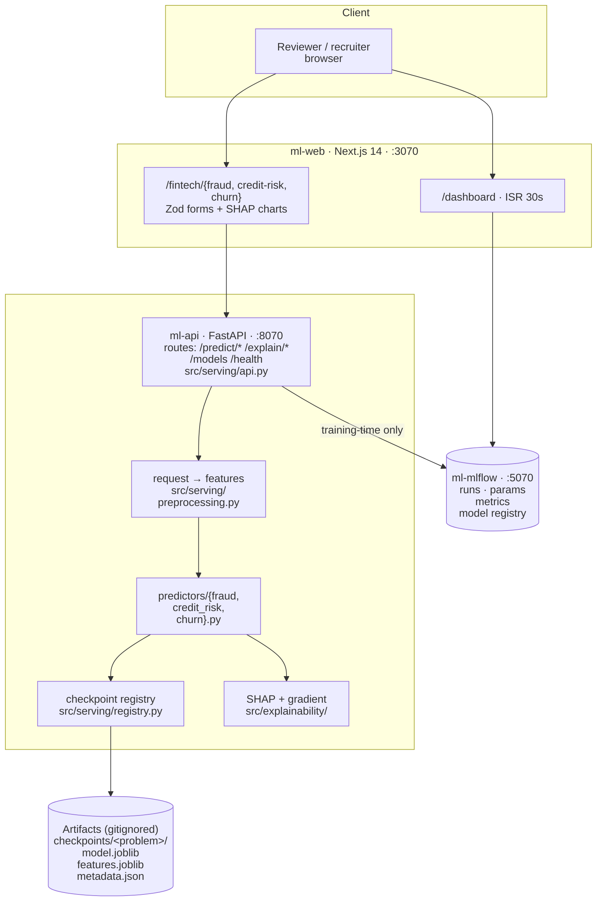
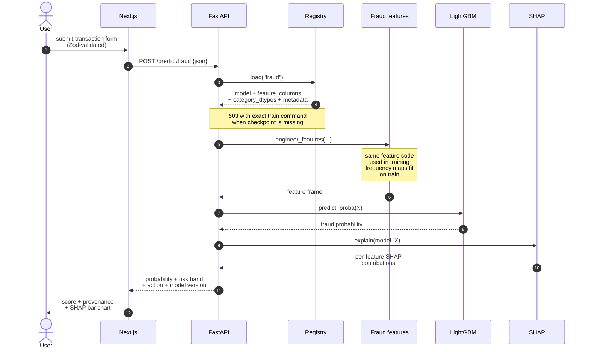
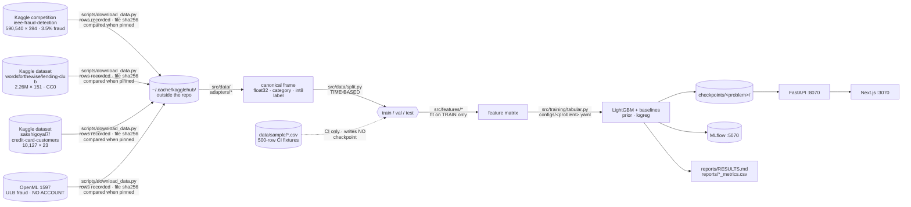

# Architecture

Three services, one data path, no database.

Each diagram below is also exported to [`docs/diagrams/`](diagrams/) as an SVG by
`make diagrams`, so it exists as a file and not only as a fenced block.

---

## Container view



**Design decision this encodes.** The API discovers models by globbing
`checkpoints/*/metadata.json`. Adding a model requires no change to `api.py` and
no redeploy. A fresh clone with zero checkpoints reports `status: ok` with three
unavailable models without entering a crash loop.

**Why the browser only ever talks to Next.js.** `next.config.mjs` rewrites
`/api/*` to the FastAPI container server-side. One origin means no CORS
preflight, no CORS middleware in the backend, and no second hostname to configure
per environment.

**There is no application database.** The three `predict` endpoints are pure
functions of their request plus a checkpoint on disk; nothing is persisted. The
only durable state is MLflow's own SQLite store, which is a vendor schema this
project does not own. This document contains no entity-relationship diagram
because the project has no application data model to describe.

---

## The critical path: one prediction



**Design decision this encodes.** `src/serving/registry.py` loads the checkpoint,
training and serving both call `src/features/fraud_features.py`, and
`src/explainability/shap_explainer.py` provides the explanation. Sharing the
implementation removes a second feature path that could diverge.
`tests/serving/test_skew.py` scores the same rows through both paths and demands
identical matrices.

Step 3 returns **503** when a checkpoint is missing, not a 500. The service is
healthy, but the model has not been trained. The response includes the exact
training command. HTTP 500 denotes an internal server error, which is not the
service state.

---

## Data pipeline



**Design decision this encodes.** The split happens **before** feature
engineering, not after. Frequency encodings and group aggregates are fitted on
the training rows only and carried forward as artifacts; fitting them on the full
frame leaks information about the test distribution and does not represent
deployment.

The dotted edge shows fixture isolation: the CI fixtures reach the trainer but
**cannot** reach MLflow, W&B, `checkpoints/` or `reports/`.
`TabularTrainer` makes the sample flag known before tracking is initialized;
dashboard history also requires `sample=false` plus matching problem/config
tags. There is no code path from a synthetic fixture to a published number.

For stratified cross-validation, the model edge has two distinct outputs:
out-of-fold predictions grade the model and feed performance figures, while a
separate estimator refit on all rows becomes the serving checkpoint. Keeping
those roles separate prevents an all-row refit from evaluating itself.

---

## Why `conftest.py` lives at the repository root

The root location establishes the import order before test collection:

```python
import lightgbm  # noqa: F401
import xgboost   # noqa: F401
```

LightGBM, XGBoost and PyTorch each vendor their own copy of `libomp`. On macOS,
importing PyTorch first and then one of the boosters aborts the process. The root
`conftest.py` runs before any test module is collected and forces the safe import
order; `tests/conftest.py` additionally sets `KMP_DUPLICATE_LIB_OK=TRUE` before
any import at all.

---

## Hardware notes

Development hardware: Apple Silicon, 4 performance + 6 efficiency cores, 32 GB
RAM, torch 2.13.0, MPS available.

- **LightGBM and XGBoost ship CPU-only wheels on macOS arm64.** No Metal backend
  exists for either. The three headline models are gradient-boosted trees, so
  MPS buys them nothing; `n_jobs` in the config is the only lever that matters.
- **MPS is available for the fraud autoencoder baseline.** This repository does
  not contain a committed MPS-versus-CPU benchmark, so it makes no speedup claim.
- `torch.get_num_threads()` defaults to **4**, not 10.
- **torch 2.13.0 MPS bug, reproduced twice on this machine:**
  `torch.nn.MultiheadAttention` hangs on MPS, and a CPU tensor loop deadlocked at
  0% CPU after a preceding MPS matmul *in the same process*. This repository has
  no attention layer. The test suite forces MPS off session-wide, and the
  serving path never touches MPS. Any future sequence model must run one process
  per device.
- In Docker, `infra/docker/api.Dockerfile` force-installs CPU PyTorch. MPS is
  macOS-only and cannot exist in a Linux container.
